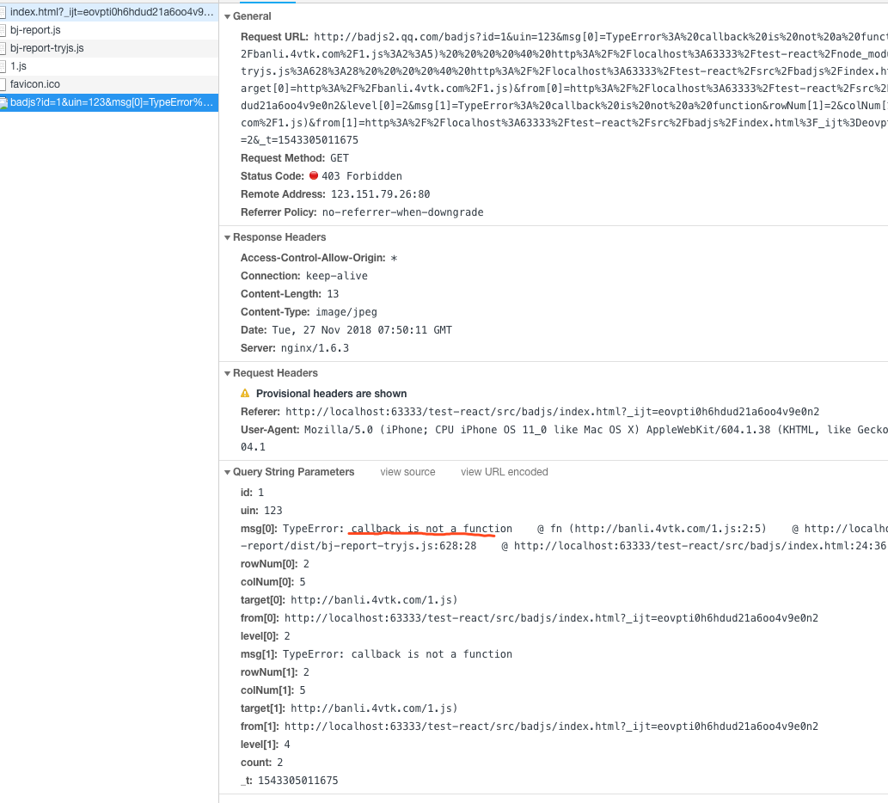

---
        title: 无名
        ---
        # BetterJS异常监控实战

Better是腾讯开源的一个前端异常监控解决方案。其中包括下面几个库：
- `badjs-report`：用来将前端异常日志上报给服务端

## badjs-report

**参考内容**

- github库地址：[badjs-report](https://github.com/BetterJS/badjs-report)
- [Script Error](https://github.com/BetterJS/badjs-report/issues/3)
- [什么是 offlineLog ?](https://github.com/BetterJS/badjs-report/issues/25)

这个库能够监控js语法和运行报错，异步报错(如setTimeout里的代码)以及跨域资源的报错。

**1. 首先安装库**
```javascript
npm i badjs-report
// bower install https://github.com/BetterJS/badjs-report.git
// ego install badjs-report --save
```

dist目录下有2类文件:
- `bj-report.js`：改写了 window.onerror，能捕获js语法错误和运行期的错误，不过语法错误会导致后续代码不执行，所以需要try...catch。
- `bj-report-tryjs.js`：将运行的代码包裹一层try...catch

**2. 初始化配置**

```javascript
// 初始化
BJ_REPORT.init({
  id: 1,                                // 上报 id, 不指定 id 将不上报
  uin: 123,                             // 指定用户 id, (默认已经读取 qq uin)
  delay: 1000,                          // 当 combo 为 true 可用，延迟多少毫秒，合并缓冲区中的上报（默认）
  url: "//badjs2.qq.com/badjs",         // 指定上报地址
  ignore: [/Script error/i],            // 忽略某个错误
  random: 1,                            // 抽样上报，1~0 之间数值，1为100%上报（默认 1）
  repeat: 5,                            // 重复上报次数(对于同一个错误超过多少次不上报)
                                        // 避免出现单个用户同一错误上报过多的情况
  onReport: function(id, errObj){},     // 当上报的时候回调。 id: 上报的 id, errObj: 错误的对象
  submit: null,                         // 覆盖原来的上报方式，可以自行修改为 post 上报等
  ext: {},                              // 扩展属性，后端做扩展处理属性。例如：存在 msid 就会分发到 monitor,
  offlineLog : false,                   // 是否启离线日志 [默认 false]
  offlineLogExp : 5,                    // 离线有效时间，默认最近5天
});
```

BJ_Report 是重写了 window.onerror 进行上报的，无需编写任何捕获错误的代码。

如果需要手动上报，可以使用下面的report方法：

```javascript
BJ_REPORT.report("error msg");

BJ_REPORT.report({
  msg: "xx load error",                 // 错误信息
  target: "xxx.js",                     // 错误的来源js
  rowNum: 100,                          // 错误的行数
  colNum: 100,                          // 错误的列数
});

try{
    // something throw error ...
}catch(error){
    BJ_REPORT.report(e);
}
```

当然还可以延迟上报。

```javascript
BJ_REPORT.push("error msg");

BJ_REPORT.push({
  msg: "xx load error",                 // 错误信息
  target: "xxx.js",                     // 错误的来源js
  rowNum: 100,                          // 错误的行数
  colNum: 100,                          // 错误的列数
});

BJ_REPORT.report();
```

**3.上报离线日志**

用户pv太高时，频繁的上报日志会影响用户流量，浪费存储，对服务器有压力。所以有需要的话可以使用offlinelog离线日志。

- info、error、debug 上报过多会造成流量的浪费，而且在弱网络下面还会造成流失。
- info 和 offlineLog 的区别在于 info 不仅会记录离线日志，同时也会实时上报

所以建议每个小时高于500左右的上报量，可以建议采用offlineLog ，而且我们推荐你使用 offlienLog 详细记录用户的操作日志，便于后面排查问题

offloneLog 使用浏览器的 indexdb 进行存储日志的，badjs-report 的所有上报都会记录到离线日志中。而且有效期默认是最近5天，所以用户不用担心用户本地的日志过多。

```javascript
BJ_REPORT.reportOfflineLog();
```

用法如下：

```
//初始化
BJ_REPORT.init({id: 1})
BJ_REPORT.init({
    offlineLog: true  // 默认是false，需要设置为true
})

//主动上报错误日志
BJ_REPORT.report("error msg 2");

//info上报，用于记录操作日志
BJ_REPORT.info("info");

//可以结合实时上报，跟踪问题; 不存入存储
BJ_REPORT.debug("debug");

//记录离线日志  
BJ_REPORT.offlineLog("offlineLog");
```

**4.异步代码、库文件和跨域js报错**

我们知道window.onerror不能捕获异步代码，如setTimeout里的报错。还有跨域js报错也无法捕获。这时就需要使用`bj-report-tryjs.js`了。它是将这些方法改写包裹了try...catch。

```javascript
// 包裹 js 的 setTimeout , setInterval 方法 
BJ_REPORT.tryJs().spySystem();

// 包裹 jquery 的 event.add , event.remove , event.ajax 这几个异步方法。 
BJ_REPORT.tryJs().spyJquery();

// 包裹 模块化框架 的 define , require 方法 
BJ_REPORT.tryJs().spyModules();

//自动运行 SpyJquery , SpyModule , SpySystem
BJ_REPORT.tryJs().spyAll();

// 包裹自定义代码
var customFunction = function (){};
customFunction  = BJ_REPORT.tryJs().spyCustom(customFunction ); 

// 只会包裹 customOne  , customTwo
var customObject = { customOne : function (){} , customTwo : function (){} , customVar : 1}
BJ_REPORT.tryJs().spyCustom(customObject );
```

比如我引入了跨域资源`xx.com/1.js`。代码如下。

```javascript
// xx.com/1.js
var fn = function (callback) {
    callback()
}
```

我的html文件如下：

```html
<!doctype html>
<html lang="en">
<head>
    <meta charset="UTF-8">
    <title>Document</title>
</head>
<body>
<script src="http://banli.4vtk.com/1.js"></script>
<script>
    window.onerror = function(msg){console.log(msg)}
    fn('hi') 
</script>
</body>
</html>
```

如果不使用`badjs-report`上面的代码只会报错`Script error`。


但是加入`badjs-report`后，它就能捕获到具体的错误了。

```html
<script src="../../node_modules/badjs-report/dist/bj-report.js"></script>
<script src="../../node_modules/badjs-report/dist/bj-report-tryjs.js"></script>
<script>
    BJ_REPORT.init({
        id: 1,
        url: "//badjs2.qq.com/badjs",
        uin: 123,
        repeat: 1
    });
    BJ_REPORT.tryJs().spySystem();
</script>
<script src="http://banli.4vtk.com/1.js"></script>
<script>
    BJ_REPORT.tryJs().spyCustom(fn)()
</script>
```




