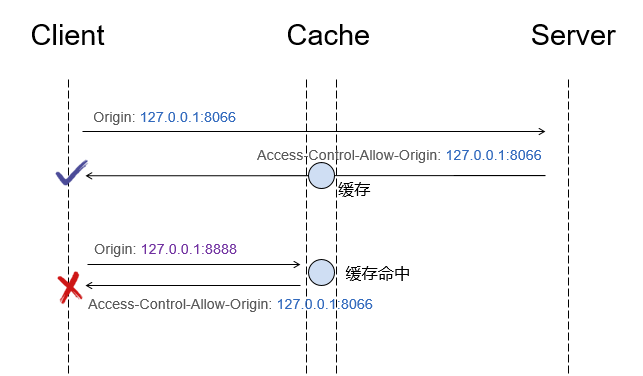
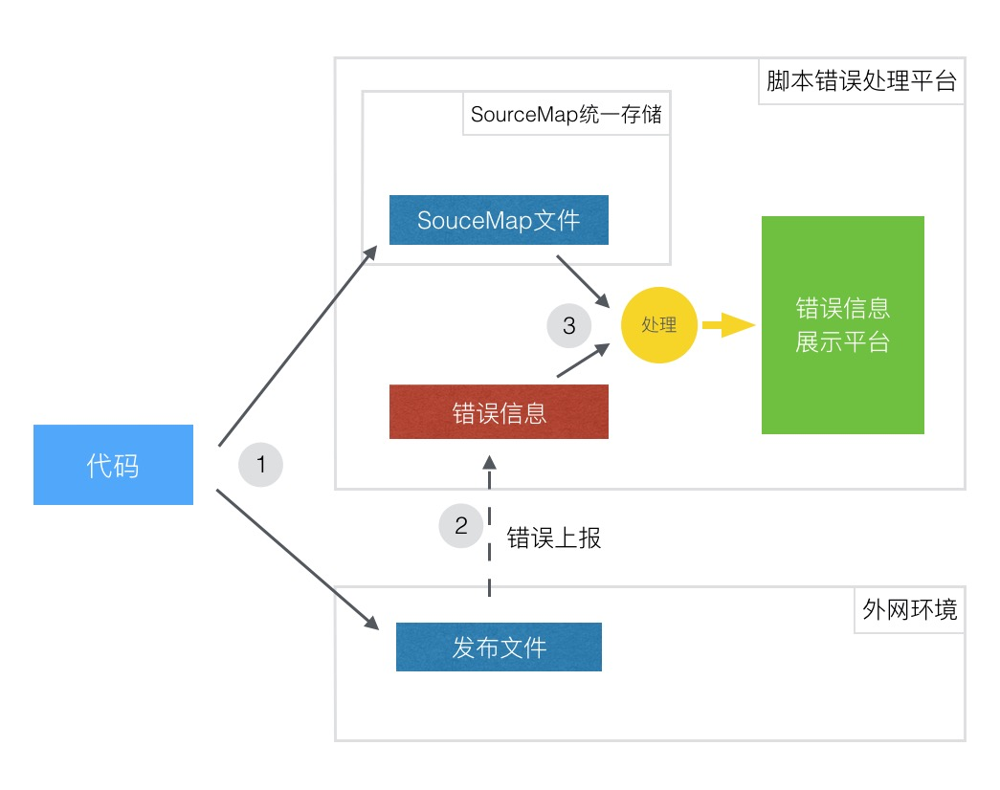

---
        title: 无名
        ---
        # 前端错误监控

## 参考资料

- [脚本错误量极致优化-监控上报与Script error](http://www.alloyteam.com/2017/03/jserror1/)
- [脚本错误量极致优化-让脚本错误一目了然](http://www.alloyteam.com/2017/05/jserr2/)
- https://github.com/BetterJS/badjs-report
- [Script error](https://github.com/BetterJS/badjs-report/issues/3)
- [前端代码异常监控实战](https://github.com/happylindz/blog/issues/5)
- [badjs](https://betterjs.github.io/)
- [前端相关数据监控](http://www.alloyteam.com/2014/03/front-end-data-monitoring/)
- [JSTracker：前端异常数据采集](http://taobaofed.org/blog/2015/10/28/jstracker-how-to-collect-data/)

## 可能的错误有那些？

- js脚本错误
- 静态资源加载错误
- ajax失败404


## 目的

1. onerror捕获JavaScript异常，对应跨域检测也有方案；
2. addEventListener('error', handler, true)来捕获静态资源异常，包括js、img、css等；
3. Resource Timing API 和 Performance Timing API来进行性能检测和内存检测；
4. 扩展XHR原型，检测返回的状态码，如404等，来检测ajax请求失败、错误；
5. 通过正则匹配等方式去检测DOM结构的合法性，如ID重复、文档类型未声明之类的；
6. 页面的死链接可以通过Nodejs的第三方模块，如request等，来检测。

## 错误监控

1、js代码的错误分为语法错误和运行期错误。语法错误可以通过try...catch捕获，运行期错误可以通过window.onerror捕获。

```javascript
window.onerror = function(msg, url, row, col, error){}
```

2、try...catch捕获不到异步错误，如setTimeout。

3、错误的上报主要有2种方式：ajax和Img标签。

```javascript
function report(){
    var reportUrl = "http://localhost:8055/report";
    new Image().src = reportUrl + '?msg=' + msg
}
```

4、window.onerror对于跨域脚本，浏览器只会返回Script error字符串。

优化的方式有2种：1、同源化，但是内联无法利用文件缓存，外链又无法充分利用cdn了。2、跨域资源共享(cors)。需要开启script标签的crossorigin属性，它会在请求头发送Origin字段。同时后端需要设置`Access-Control-Allow-Origin:*`属性以支持。

如果后端是指定某个域可以访问，则响应头还需要加上`Vary：Origin`，它会根据域名来进行缓存。如果不加Vary，会存在错误命中缓存的问题。



```javascript
app.use(function *(next){
    // 拿到请求头中的 Origin
    var requestOrigin = this.get('Origin'); 
    if (!requestOrigin) { // 不存在则忽略
      return yield next;
    }
 
    // 设置 Access-Control-Allow-Origin: Origin
    this.set('Access-Control-Allow-Origin', requestOrigin);
 
    // 设置 Vary: Origin
    this.vary('Origin');
    return yield next;
});
```

5. 压缩的js错误定位。使用SourceMap。SourceMap 是一个信息文件，存储着源文件的信息及源文件与处理后文件的映射关系。
                         
SourceMap 文件中的 sourcesContent 字段对应源代码内容，不希望将 SourceMap 文件发布到外网上，而是将其存储到脚本错误处理平台上，只用在处理脚本错误中。



## 错误的采集

1. `window.onerror`可以捕获到页面中的语法错误，和运行期错误。不过语法错误不能和`window.onerror`在同层。可以拿到出错的信息，堆栈，出错的文件，行列号。跨域资源需要添加`crossorigin`属性，后台添加。
2. `try...catch`捕获到的错误不会上报到`window.onerror`。无法捕获语法错误。需要把所有function块都加上`try...catch`，很麻烦。
3. 像Vue，React这样的框架都有自己捕获错误的方法
4. 跨域的js报错，`window.onerror`只会捕获到`Script error`的错误，获取不到详细信息
5. 请求接口的错误。

发送错误可以直接使用new Image()，设置src即可。

## 日志

后端写入日志。

## 分析

crossorigin="anonymous"表示，读取文件不需要身份信息，即不需要cookie和HTTP认证信息。如果设为crossorigin="use-credentials"，就表示浏览器会上传cookie和HTTP认证信息，同时还需要服务器端打开HTTP头信息Access-Control-Allow-Credentials。


## crossorigin的作用

crossorigin可以控制对内容的CORS访问，可以只运行某些站访问本站的资源文件。

默认情况下没有crossorigin，对于跨域的js、audio、图片资源等，脚本报错通过window.onerror只会捕获到`Script error.`。HTTP请求头没有`Origin`。

h5规定可以运行本地获取跨域脚本错误信息，但是有2个条件。1

1. 加了crossorigin，则空字符不识别都会认为是`anonymous`
2. 服务端必须要配置`Access-Control-Allow-Origin`。否则跨域错误。`Origin`会带在HTTP请求头上。服务端可以验证判断是否返回资源。

- `anonymous`
- `use-credentials`


`integrity`字段用来验证资源的哈希值。不匹配则js不会被浏览器执行，这样可以防止恶意篡改资源。


## SourceMap原理

http://www.ruanyifeng.com/blog/2013/01/javascript_source_map.html

## 报警
前端异常监控系统的落地  https://zhuanlan.zhihu.com/p/26085642


