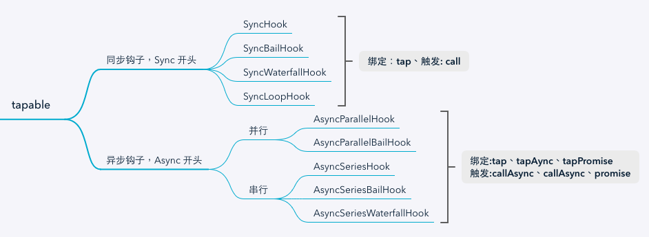
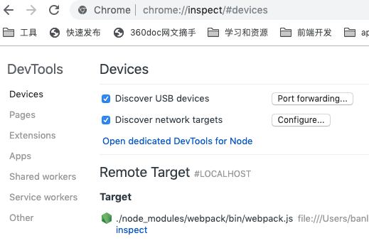

* [x] Markdown  
* [ ] JavaScript

1. 指南
1. 打包结果分析
    1. 同步
    2. 异步
1. loader
    1. babel-loader
    1. css-loader style-loader
    1. file-loader
1. plugin  - tapable - ast
1. 编译流程

> webpack 作为现在前端的一大利器，虽然说平时工作中都是用的脚手架，自定义的需求不多，但是[官方文档](https://webpack.js.org/concepts/)还是要细读几遍的。这篇笔记是阅读文档的总结，当然，遇到细节时还是需要再查文档。

webpack 是一个静态模块打包器，它可以根据入口文件生成依赖关系图，然后打成一个包(或多个)。

## 入口 entry

如果通过 `entry: String|Array|Object` 配置。当为数组时，会将数组里的文件打包成一个。Object 可以用于多页应用。

```js
// 单页应用
module.exports = {
//   entry: {
//     main: './path/entry.js'
//   }
  entry: './path/entry.js' 
};

// 多页应用
module.exports = {
  entry: {
    pageOne: './src/pageOne/index.js',
    pageTwo: './src/pageTwo/index.js',
    pageThree: './src/pageThree/index.js'
  }
};
```

## 出口 output

output 告诉 webpack 如何将打包后的文件写入磁盘。

```js
module.exports = {
  entry: {
    app: './src/app.js',
    search: './src/search.js'
  },
  output: {
    filename: '[name].js',  // [name] 是个变量，根据 entry 来的
    path: __dirname + '/dist'
  }
};

// 会写到磁盘: ./dist/app.js, ./dist/search.js
```

如果利用 CDN，可以：

```js
module.exports = {
  //...
  output: {
    path: '/home/proj/cdn/assets/[hash]',
    publicPath: 'https://cdn.example.com/assets/[hash]/'
  }
};
```

还可以在入口文件中使用 __webpack_plugin_path__ 变量指定：

```js
__webpack_public_path__ = myRuntimePublicPath;
// rest of your application entry
```


## Loader

默认情况下，webpack 只认识 .js 和 .json 文件。如果有其它类型文件，如 css，则需要使用 loader 将它转换为 js 模块。

loader 可以配置 test 和 use。

```js
const path = require('path');
module.exports = {
  output: {
    filename: 'my-first-webpack.bundle.js'
  },
  module: {
    rules: [
      { test: /\.txt$/, use: 'raw-loader' }
    ]
  }
};
```

上面代码相当于告诉 webpack，当遇到 `require() / import` 引入 .txt 文件的语句时，使用 raw-loader 来转换它。

有三种方式可以配置 loader。

- 文件，如 webpack.config.js。
- 行内：特别指定 import 语句

```js
// 普通使用法：资源和loader 之间通过 ! 分开
import Styles from 'style-loader!css-loader?modules!./styles.css';

// ! 禁用普通loaders
import Styles from '!style-loader!css-loader?modules!./styles.css';

// !! 禁用所有loader(preLoaders、loaders、postLoaders)
import Styles from '!!style-loader!css-loader?modules!./styles.css';

// -! 禁用preLoaders、loaders
import Styles from '-!style-loader!css-loader?modules!./styles.css';

// 可以通过 ? 传递参数 k=v&k1=v1 或 json 对象 ?{'k':'v'}
```

- cli

```
webpack --module-bind jade-loader --module-bind 'css=style-loader!css-loader'
```

loader 的特点：
1. loaders 是链式调用的，从后往前处理
2. loaders 可以是同步和异步
3. loaders 可以配置 options 参数


### 编写 Loader

## tapable

webpack 插件内部实现是自己写的一个名叫 tapable 库，如果不学习一下它，看插件这部分内容可能会很蒙。

tapable 是一个类似 nodejs EventEmitter 的发布订阅模式库，不过它要强大的多。它提供了一些 api：

```js
const {
	SyncHook,
	SyncBailHook,
	SyncWaterfallHook,
	SyncLoopHook,
	AsyncParallelHook,
	AsyncParallelBailHook,
	AsyncSeriesHook,
	AsyncSeriesBailHook,
	AsyncSeriesWaterfallHook
} = require("tapable");
```

先感受一下用法：

```js
const { SyncHook } = require("tapable");
let queue = new SyncHook(['name'])
queue.tap('1', function (name) {
    console.log(11, name)
})
queue.tap('2', function (name) {
    console.log(22, name)
})
queue.call('hi')
// 结果
// 11 'hi'
// 22 'hi'
```




**钩子的分类**

钩子可以按同步和异步分类，分为。

- Sync 开头的是同步钩子，只能用 tap 绑定事件，用`call()`触发，绑定事件时需要传入事件名和事件函数；

- Async 开头的是异步钩子，可以用 tap、tapAsync、tapPromise 绑定事件，但是它没有 call 方法，对应的需要用`callAsync()`、`promise()`触发。

同步钩子只支持串行，即执行完一个再执行下一个。异步钩子分为串行和并行。并行相当于 Promise.all()。

钩子还可以按功能来分类，分为。

- `Hook`:普通钩子， 与事件函数执行的返回值无关；

- `BailHook`: 保险钩子 ，一旦事件函数返回 null，则后面的钩子不再执行；

- `WaterfallHook`: 瀑布流钩子， 上一个事件函数执行结果会作为参数传递给下一个事件函数，如果当前没有返回值，则上一个返回结果会穿透给下一个函数。

- `LoopHook`: 循环钩子，如果事件函数返回值不为 undefined，则重复执行，否则(即return 或 return undefined)会执行下一个。

**备注**

1. 所有的钩子都接受一个可选参数，用来声明事件函数要接收的参数。如下：

```js
const { SyncHook } = require("tapable");
// 只声明了一个参数name，结果 call 时传入了多的参数，会被忽略掉
let queue = new SyncHook(['name'])
queue.tap('1', function (name, age) {
    console.log(11, name, age)  // 11, zhangsan, undefined
})
queue.call('zhangsan', 12)
```

2. 拦截器 intercept() 方法可以钩子运行期间做一些事情。

```js
myCar.hooks.calculateRoutes.intercept({
	call: (source, target, routesList) => {
		console.log("Starting to calculate routes");
	},
	register: (tapInfo) => {
		// tapInfo = { type: "promise", name: "GoogleMapsPlugin", fn: ... }
		console.log(`${tapInfo.name} is doing its job`);
		return tapInfo; // may return a new tapInfo object
	},
    loop:(...args) =>{},
    tap: (tap) => {}
})
```

3. context 对象，可以通过这个对象传递自己需要的数据给后续插件或拦截器。

```js
myCar.hooks.accelerate.intercept({
	context: true,
	tap: (context, tapInfo) => {
		// tapInfo = { type: "sync", name: "NoisePlugin", fn: ... }
		console.log(`${tapInfo.name} is doing it's job`);

		// `context` starts as an empty object if at least one plugin uses `context: true`.
		// If no plugins use `context: true`, then `context` is undefined.
		if (context) {
			// Arbitrary properties can be added to `context`, which plugins can then access.
			context.hasMuffler = true;
		}
	}
});

myCar.hooks.accelerate.tap({
	name: "NoisePlugin",
	context: true
}, (context, newSpeed) => {
	if (context && context.hasMuffler) {
		console.log("Silence...");
	} else {
		console.log("Vroom!");
	}
});
```

4. HookMap 是用来映射 key -> Hook 的一个帮助类。

```js
const keyedHook = new HookMap(key => new SyncHook(["arg"]))
keyedHook.tap("some-key", "MyPlugin", (arg) => { /* ... */ });
keyedHook.tapAsync("some-key", "MyPlugin", (arg, callback) => { /* ... */ });
keyedHook.tapPromise("some-key", "MyPlugin", (arg) => { /* ... */ });
const hook = keyedHook.get("some-key");
if(hook !== undefined) {
	hook.callAsync("arg", err => { /* ... */ });
}
```

5. MultiHook 可以将多个 hook 合起来一起操作。

```js
const { MultiHook } = require("tapable");
this.hooks.allHooks = new MultiHook([this.hooks.hookA, this.hooks.hookB]);
```

下面详细看一下各个钩子的用法。

**1. SyncHook**

串行同步执行，当调用 `call()`方法时它会一个个执行 tap 绑定的函数，如下。

```js
const { SyncHook } = require("tapable");
let queue = new SyncHook(['name'])
queue.tap('1', function (name) {
    console.log(11, name)
})
queue.tap('2', function (name) {
    console.log(22, name)
})
queue.call('hi')
```

**2. SyncBailHook**

同步保险钩子，如果有一个事件函数返回值为 null 则停止执行后面的事件函数。

```js
let {SyncBailHook} = require('tapable')
let h = new SyncBailHook(['name'])
h.tap('1', function (name) {
    console.log('1', name)
})
h.tap('2', function (name) {
    console.log('2', name)
    return null
})
h.call('hi')
```

**3. SyncWaterfallHook**

同步瀑布流钩子，上一个事件函数的返回值会作为下一个事件函数的参数，如果当前没有返回值或返回 undefined 则上一个事件函数的返回值会穿透给下一个事件函数的参数。

```js
let {
    SyncWaterfallHook
} = require('tapable')
let h = new SyncWaterfallHook(['name'])
h.tap('1', function (name) {
    console.log(name, 1)
    return 11
})
h.tap('2', function (data) {
    console.log(data, 2)
})
h.call('zs')

// zs 1
// 11 2
```

**4. SyncLoopHook**

同步循环钩子，如果当前事件函数的返回值为 undefined，则继续执行下一个，否则一直循环执行。要注意的是返回值不会传递给下一个事件函数，只有瀑布流钩子与返回值有关。

```js
const {SyncLoopHook } = require('tapable')
let h = new SyncLoopHook(['name'])
let count = 0
h.tap('1', function (name) {
    console.log(count)
    count++
    if (count === 3) {
        return 
    }
    return true
})
h.tap('2', function (name) {
    console.log(name)
})
h.call('hi')
```

**5. AsyncParallelHook**

异步并行钩子，可以通过 tap、tapAsync、tapPromise 三种方式绑定事件，对应的需要用 callAsync()、callAsync()、promise() 方法触发，它们的最后一个参数是一个回调函数。

1. tap + callAsync() 搭配，和 SyncHook 效果一样。

```js
let { AsyncParallelHook } = require('tapable')
let h = new AsyncParallelHook(['name'])
console.time('cost')
h.tap('1', function (name) {
    setTimeout(() => {
        console.log(1, name)
    }, 1000)
})
h.tap('2', function (name) {
    setTimeout(() => {
        console.log(2, name)
    }, 2000)
})
h.callAsync('hi', err => {
    console.log('err:', err)
    console.timeEnd('cost')  
})

// err:undefined
// cost: 10.181ms
// 1 hi
// 2 hi
```

2. tapAsync + callAsync() 搭配，则需要使用事件回调函数的最后一个参数 callback，表示事件执行完成了，如果有一个事件回调函数没有调用 callback()，则不会触发 callAsync() 的回调。

```js
let { AsyncParallelHook } = require('tapable')
let h = new AsyncParallelHook(['name'])
console.time('cost')
h.tapAsync('1', function (name,callback) {
    setTimeout(() => {
        console.log(1, name)
        callback()
    }, 1000)
})
h.tapAsync('2', function (name,callback) {
    setTimeout(() => {
        console.log(2, name)
        callback()   
    }, 2000)
})
h.callAsync('hi', err => {
    // 假设其中一个不使用callback()，则这里回调不会执行
    console.log('err:',err)
    console.timeEnd('cost')
})
// 1 hi
// 2 hi
// err:undefined
// cost: 2008.706ms
```

3. tapPromis + promise() 搭配，事件处理函数需要返回一个 promise。

```js
let { AsyncParallelHook } = require('tapable')
let h = new AsyncParallelHook(['name'])
console.time('cost')
h.tapPromise('1', function (name, callback) {
    return new Promise((resolve, reject) => {
        setTimeout(() => {
            console.log(1, name)
            resolve('xx')
        }, 1000)
    })
})
h.tapPromise('2', function (name, callback) {
    return new Promise((resolve, reject) => {
        setTimeout(() => {
            console.log(2, name)
            resolve('xx')
        }, 2000)
    })
})
h.promise('hi').then((data)=> {
    // 这里data 不会接收resolve(data)的返回值，除非用 waterfall 类型的钩子
    console.log(`data:${data}`) 
    console.timeEnd('cost')
})

// 1 hi
// 2 hi
// cost: 2008.312ms
```

4. 不要用 tapAsync + promise() 搭配或其它搭配方式，有很多问题，而且从名字来看也是不合理的。

**6. AsyncParallelBailHook**

异步并行保险钩子，一旦有事件函数返回值为真值(`if(data)`)，则终止。

1. tap + callAsync() 搭配。一旦有事件函数返回值为真，则执行 callAsync 回调不再执行其它事件函数。
2. tapAsync + callAsync() 搭配，一旦有事件函数的回调 callback(真值)，则执行 callAsync 回调，继续执行其它事件函数。
3. tapPromsie + promise() 搭配，一旦有reject()，则执行 promise.then() 的 onRejected，只有全部都 resolve()，才执行promise.then 的 onFullfilled。

**7. AsyncSeriesHook**

异步串行钩子

**8. AsyncSeriesBailHook**

异步串行保险钩子

**9. AsyncSeriesWaterfallHook**

异步串行瀑布流钩子

## 插件

看完了上面的 tapable 的介绍，再看插件这部分内容就一路通畅了。

插件调用方式很多，可以在 webpack.config.js 的 plugins 配置里通过 new 调用，也可以通过 nodejs：

```js
const webpack = require('webpack'); //to access webpack runtime
const configuration = require('./webpack.config.js');
let compiler = webpack(configuration);
new webpack.ProgressPlugin().apply(compiler);
compiler.run(function(err, stats) {
  // ...
});
```

上面代码和 webpack 内部源码很像。

### 编写插件

webpack 插件是一个拥有 apply() 方法的类，在 apply 方法里绑定事件，webpack 会在生命周期里触发。

```js
class MyExampleWebpackPlugin {
  apply(compiler) {
    compiler.hooks.emit.tapAsync( 'MyExampleWebpackPlugin', (compilation, callback) => {
        // ... 可以写自定义要做的事, webpack 文件发射(emit) 时执行

        compilation.hooks.optimize.tap('HelloCompilationPlugin', () => {
            // webpack编译期间,优化代码时执行
            console.log('Assets are being optimized.');
        });
        callback()
      }
    );
  }
}
```

同步的钩子只能通过 tap 绑定事件，异步的钩子可以用 tapAsync 绑定事件，但是最后要用 callback() 告诉 webpack 事情做完了，继续往下执行。钩子在下面有介绍。

这些插件可以绑定在 webpack 生命周期或编译周期执行。可以加载插件的常用对象有：compiler、compilation 、parser 和 resolvers。

- compiler 对象代表了完整的 webpack 环境配置。这个对象在启动 webpack 时被一次性建立，并配置好所有可操作的设置，包括 options，loader 和 plugin。当在 webpack 环境中应用一个插件时，插件将收到此 compiler 对象的引用。可以使用它来访问 webpack 的主环境。如果是`--watch`模式，这个对象会监听文件的改变后重新编译，并发出额外的事件`watchRun`、`watchClose`、`invalid`，一般用于开发模式，在`webpack-dev-server`里被使用。

- compilation 对象代表了一次资源版本构建。当运行 webpack 开发环境中间件时，每当检测到一个文件变化，就会创建一个新的 compilation，从而生成一组新的编译资源。一个 compilation 对象表现了当前的模块资源、编译生成资源、变化的文件、以及被跟踪依赖的状态信息。compilation 对象也提供了很多关键时机的回调，以供插件做自定义处理时选择使用。

- parser: 解析 webpack 正在处理的模块。

常用的钩子列表：

对象|钩子|
---|---
compiler|run,compile,compilation,make,emit,done
compilation|buildModule,normalModuleLoader,succeedModule,finishModules,seal,optimize,after-seal
Parser|program,statement,call,expression
Module Factory|beforeResolver,afterResolver,module,parser
Resolvers|hash,bootstrap,localVars,render

具体的列表，点击查看：[webpack API PLUGINS](https://webpack.js.org/api/compiler-hooks/)

当然，如果不满足于这些钩子，还可以使用 tapable 自定义钩子。

```js
const {SyncHook} = require('tapable');

// 在 `apply` 方法里...
if (compiler.hooks.myCustomHook) throw new Error('Already in use');
compiler.hooks.myCustomHook = new SyncHook(['a', 'b', 'c']);

// 在合适的地方触发
compiler.hooks.myCustomHook.call(a, b, c);
```

### 钩子类型

类型|钩子名|实例
--|--|--
同步钩子|SyncHook|
 |SyncBailHook|optimizeChunks、optimizeChunkModules
 |SyncWaterfallHook|ModuleTemplate，ChunkTemplate
异步钩子|AsyncSeriesHook|emit，run
 | AsyncWaterfallHook|beforeResolve、afterResolve
 | AsyncSeriesBailHook |
 | AsyncParallelHook|
 | AsyncSeriesBailHook |

### 例子

> 如果我们需要在 webpack 打包后的文件中增加一个`filelist.md`，里面显示一个列表，是所有文件的大小信息。

```js
class FileListPlugin {
  apply(compiler) {
    // emit 是一个异步钩子，可以用 tapAsync 绑定事件, 当然也可以用 tapPromise/tap 绑定
    compiler.hooks.emit.tapAsync('FileListPlugin', (compilation, callback) => {
      // 开始拼接 filelist 里的信息
      var filelist = 'In this build:\n\n';
      // 遍历要编译输出文件，compilation.assets 包含所有要输出到 dist 的文件信息
      for (var filename in compilation.assets) {
        filelist += '- ' + filename + '\n';
      }
      // 在要输出的文件对象里新增一个 filelist.md
      compilation.assets['filelist.md'] = {
        source: function() {
          return filelist;
        },
        size: function() {
          return filelist.length;
        }
      };
      callback();
    });
  }
}

module.exports = FileListPlugin;
```

> 打印进度

在上面 tapable 部分，介绍过 context 可以用来给后面的插件传递数据。这里我们可以利用它和 ProgressPlugin 插件的 reportProgress() 方法来自定义打印进度。

```js
compiler.hooks.emit.tapAsync({
  name: 'MyPlugin',
  context: true
}, (context, compiler, callback) => {
  const reportProgress = context && context.reportProgress;
  if (reportProgress) reportProgress(0.95, 'Starting work');
  setTimeout(() => {
    if (reportProgress) reportProgress(0.95, 'Done work');
    callback();
  }, 1000);
});
```

`reportProgress(percentage, ...args)`的第一个参数 percentage 没有用，ProgressPlugin 会基于当前的钩子来计算进度。`...args`被用来报告给用户。


### 常用插件列表

插件|描述
---|---
BabelMinifyWebpackPlugin|
[webpack.BannerPlugin](https://webpack.js.org/plugins/banner-plugin/)|用于在打包文件头添加注释或一段文本


## 配置

## webpack 模块

webpack 模块可以是：

1. es6 import
2. commonjs require()
3. amd 的 define 和 require
4. css/sass/less 中的 @import
5. 样式表的 url() 或 html `` 里的图像 url

社区

## 模块解析

resolver 表示一个用来解析定位模块绝对路径的包。webpack 使用 `enhanced-resolve`来解析路径。它可以解析三种文件路径：

1. 绝对路径

```js
import '/home/me/file';
import 'C:\\Users\\me\\file';
```

2. 相对路径

```js
import '../src/file1';
import './file2';
```

这种情况会将资源文件的目录作为上下文目录，在 import 或 require 时生成模块的绝对路径。

3. 模块路径

```js
import 'module';
import 'module/lib/file';
```

会从 `resolve.modules` 里搜索模块，你还可以指定 `resolve.alias`。

根据上面规则解析为路径后，路径有可能是文件或目录。
- 如果路径为文件：
    - 有文件扩展名，则绑定
    - 否则，使用 resolve.extensions 解析文件扩展名
- 如果路径为目录，则
    - 有 package.json，按 `resolve.mainFields`顺序查找字段。第一个匹配的会绑定。
    - 上面找不到，则按`resolve.mainFiles`顺序查找指定的文件名
    - 使用`resolve.extensions`解析文件扩展名

resolveLoader 选项可以专门配置 loaders 的解析路径。

加载过的文件都会被缓存，在`watch`模式下，只有修改的文件会清除缓存，非`watch`模式下，每次编译都会清除缓存。


## 依赖图

当有文件依赖另一个文件时，webpack 会将它看作是依赖项。webpack 会根据入口构建依赖关系图。

## 部署目标

因为 js 可以用于浏览器和服务器，所以 webpack 可以设置部署目标。

```js
module.exports = {
  target: 'node'
};
```

上面示例中，webpack 会根据 node 环境编译，会编译成 require，而不是使用内置的 __webpack_require__。

可以编译多个目标：

```js
const path = require('path');
const serverConfig = {
  target: 'node',
  output: {
    path: path.resolve(__dirname, 'dist'),
    filename: 'lib.node.js'
  }
  //…
};

const clientConfig = {
  target: 'web', // <=== can be omitted as default is 'web'
  output: {
    path: path.resolve(__dirname, 'dist'),
    filename: 'lib.js'
  }
  //…
};

module.exports = [ serverConfig, clientConfig ];
```

上面的示例将在您的文件夹中创建一个lib.js和lib.node.js文件dist。

## Manifest

使用 webpack 打包的应用，有 3 种类型的代码。

1. 自己写的或团队写的代码
2. 第三方包的代码，通常叫 vendor
3. webpack runtime 和 manifest，用来连接所有模块的逻辑代码，

根据官方的解释: 

1. manifest 是 webpack 在浏览器端运行时 runtime 产生的加载解析模块、连接已加载模块的逻辑代码。
2. 多页面打包时，一般会提取公共文件 vendor 做缓存，但是有时修改了业务代码，vendor 的 chunkhash 也会变化，这是因为 webpack 将公共代码和 runtime 时的 manifest 打包成了 vendor，修改业务代码可能影响了 runtime，所以 vendor 的 chunkhash 也变化了，这会造成缓存失效。为了解决这个问题，可以将 manifest 单独打成一个包。

```js
optimization: {
    runtimeChunk: {
        name: 'manifest'
    },
    splitChunks: {
        cacheGroups: {
            // commons: {
            //     chunks: "initial",
            //     minChunks: 2, //最小重复的次数
            //     minSize: 0 //最小提取字节数
            // },
            vendor: {
                test: /node_modules/,
                chunks: "initial",
                name: "vendor",
            }
        }
    }
}
```

但是个人做测试时发现，如果没有配置 runtimeChunk，webpack4 并没有将 manifest 打包到 vendor 中，而是将它放在各自的入口文件中。所以修改业务代码，vendor chunkhash不会变化。不过 manifest 确实有很大一部分代码可以公用，所以最好还是将它单独打包出来。打包出来的 mainfest 代码大致如下，其实就是 webpack 打包时自己的代码：

```js
 (function(modules) { // webpackBootstrap
 	// install a JSONP callback for chunk loading
 	function webpackJsonpCallback(data) {
 		// ...
 	};
 	function checkDeferredModules() {
         // ...
 	}
 	var installedModules = {};
 	var installedChunks = {
 		"manifest": 0
 	};
 	var deferredModules = [];
 	function __webpack_require__(moduleId) {
         // ...
     }
     // __webpack_require__工具方法等 ...
 })
 ([]);
```


## 模式

通过设置 mode 参数可以配置环境为 development、production(默认) 或 none。

## 浏览器兼容性

不支持 IE8 及以下。

## tree sharking

`tree sharking`是去除无用的代码。webpack4 可以通过在 package.json 文件中指定`sideEffects`属性告诉 compiler 哪些文件是 es6 module，从而安全删除未使用的代码。

> 传统的 DCE, dead code elimination 是通过 AST 处理。

### sideEffect

`sideEffects`表示告诉 webpack 我这个包是否有[副作用](https://github.com/webpack/webpack/tree/next/examples/side-effects)(如增加了window属性、复写原生方法等)。

默认情况下，面对代码`import { a, b } from "big-module-with-flag"`，webpack 会分析代码整个`big-module-with-flag`包里的模块，因为根据 ecmascript 规范，其它子模块可能会有副作用。如果加了`sideEffects:false`，会被 webpack 改写为：`import { a } from "big-module-with-flag/a"; import { b } from "big-module-with-flag/b"`。这样相当于只引入了a.js 和 b.js。

好处是：缩小包、加快速度。

### 注意事项

要使用 tree sharking，需要注意：

1. 使用 es6 module，即 import 和 export 语法。
2. 确保 babel 没有将 es6 module 转换，可以配置 babel `{module:false}`。
3. 在 package.json 文件中，添加 sideEffect 属性。
4. 设置 `mode: production`，启用代码压缩和tree sharking。
5. class 没有做 tree sharking ，因为无法保证里面的方法只有当前对象使用，可能会被继承的类使用。
6. `export default`的模块进行`import util from 'x'`不会被tree sharking。 但是`export default * as`会被 tree sharking。

### 为什么要es6 module

ES6 module 和 CommonJS 有本质区别：

1. 只能在顶层出现，不能出现在 function 或 if 里。
2. import 模块名只能是字符串常量。
3. import 会被提升到顶部。
4. import 绑定的变量是不变量，类似 const。如`import a from './a'`，a 不能重新赋值。
5. commonjs 是动态的，比如下面的代码，不运行不知道加载哪个模块：

```js
if(a){
    require('./a.js')
}else{
    require('./b.js')
}
```

所以 es6 module 的依赖关系是确定的，和运行时无关，从而保证了可以进行可靠的静态分析。


## 调试 webpack

如果需要调试 webpack 的打包过程，可以使用命令：

```
node --inspect-brk  ./node_modules/webpack/bin/webpack.js --config webpack.config.js
```

然后打开 chrome 地址: `chrome://inspect`。点击一下`Remote Target`中要调试的程序即可。



## webpack 打包流程


## 进度

- 2019-7-6 看完了[概念部分内容](https://webpack.js.org/concepts/)


