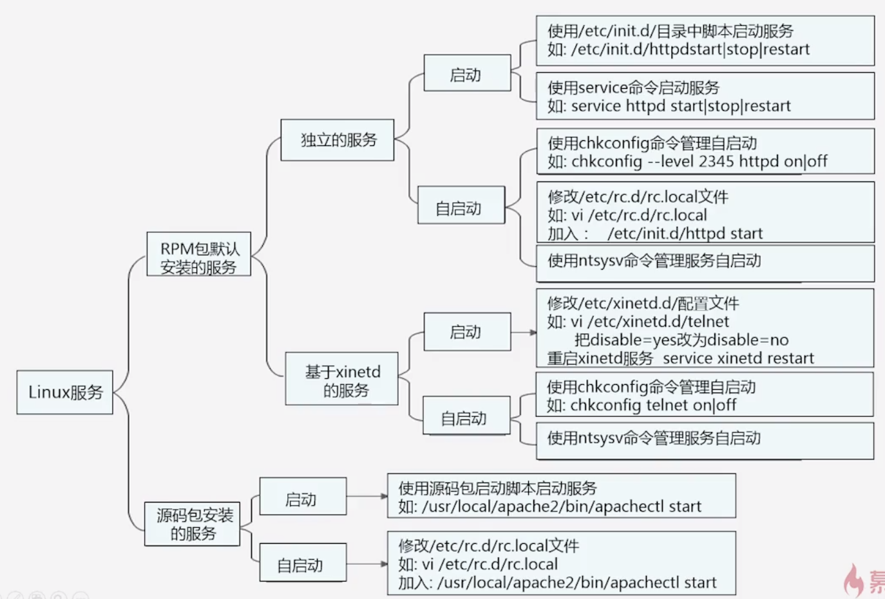

## 服务管理

### linux运行级别

```bash
# 查看运行级别
runlevel
# N 3  从NULL级别进入3级别

# 切换到图形化界面级别，即使切换失败(如没安装图形化)，级别也会切换
init 5

# 设置系统默认运行级别
vim /etc/inittab
# id:3:initdefault
```

linux的运行级别有7个：

- 0
- 1
- 2
- 3
- 4
- 5
- 6

### 服务的分类

学习服务可以让我们停掉不需要的服务，从而优化服务器。

- RPM包默认安装的服务
    - 独立的服务
    - 基于xinetd服务:基本淘汰，安装`xinetd`包后再通过`chkconfig --list`查看。
- 源码包安装的服务: 一般在`/usr/local/`下

启动和自启动：
- 自启动是服务开机是否启动。
- 启动是服务当前的状态。

```bash
# 查看RPM服务和自启动状态
chkconfig --list
```

**netstat查看系统开启的服务**

- `t`: 列出tcp数据
- `u`: 列出udp数据
- `l`: 列出正在监听的网络服务(不包含已经连接的网络服务)
- `n`: 用端口号来显示服务，而不是用服务名
- `p`: 列出服务的进程id(pid)

```bash
# 查看启动了哪些服务
netstat -tulnp

# 所有的，包括连接的
netstat -an
```

还可以通过`ps aux`命令来查看。

**常规服务端口作用列表文件**

```
vi /etc/services
```

### RPM包服务管理

RPM包安装的位置：
- `/etc/init.d/`: 启动脚本位置
- `/etc/sysconfig/`: 初始化环境配置文件位置
- `/etc/`: 配置文件位置
- `/etc/xinetd.conf/`: 配置
- `/etc/xinetd.d/`: 基于xinetd服务的启动脚本
- `/var/lib/`: 服务产生的数据
- `/var/log/`: 日志

**独立服务的启动方法**

`服务路径 start/stop/status/restart`或者redhat专有的`systemctl start/stop/status/restart 服务名`（RPM包可以，源码包不行，因为源码包不再/etc/init.d/目录下，服务命令默认搜索的这个目录）。

**独立服务的自启动**

有两种方法：

- 方法1. 使用chkconfig

```bash
# centos 7用systemctl替换chkconfig
systemctl enable http


chkconfig --level 2345 httpd on
chkconfig --level 2345 httpd off
chkconfig httpd off
```

- 方法2. 修改`/etc/rc.d/rc.local`文件，新增`/etc/httpd start`。改了之后chkconfig查询结果不会变，是两种方法。

- 方法3. 使用redhat专有`ntsysv`图形化命令，这个和chkconfig是一种方法。改了chkconfig命令查询的结果会变。

**修改xinetd服务**

```bash
# 编辑xinetd.d文件里的配置disable = no
vi /etc/xinetd.d/rsync

# 重启xinetd服务
systemctl restart xinetd
```

xinetd服务自启动和启动是同步的，关闭后自启动也关闭了。

```
chkconfig rsync on
```

### 源码包服务管理

- 启动：`源码包路径 start`
- 自启动：修改`etc/rc.d/rc.local`

### 让源码包被服务管理命令识别

- 启动`ln -s 源码包路径  /etc/rc.d/init.d/`，链接后面不写文件名表示不改名
- 自启动
    - vi /etc/init.d/apache
    - 添加`# chkconfig:35 86 76`，运行级别、启动顺序(开机时开启)、关闭顺序(关机时停止)，在`/etc/rc3.d`里3表示运行级别，K开头表示Kill，S表示Start。
    - 添加说明文件`# description: source package apache`
    - 指定httpd脚本可以被chkconfig命令管理



## 系统管理

### 进程管理

什么是进程

- 判断服务器健康状态
- 查看系统中所有进程
- 杀死进程

**ps查看进程**

- `ps aux`: 查看系统中所有进程，使用BSD操作系统格式
- `ps -le`: 查看系统中所有进程，使用Linux标准命令格式
- 选项
    - `a`: 
    - ``: 

输出：
- USER
- PID: 1表示第一个进程，它是所有进程的父进程。
- %CPU
- %MEM
- VSZ: 占用的虚拟内存
- RSS: 占用的真实内存
- TTY: 本地终端号，tty1-tty6。tty7是图形化终端。远程终端可以有65536个pst/0。?是系统进程，不是用户启动的。
- STAT: 进程状态
    - S: 睡眠
    - R: 运行
    - T: 停止
- START: 进程启动时间
- TIME: 进程耗费CPU运算时间
- COMMAND: 进程名

**pstree显示进程树**

- `p`: 显示进程pid
- `u`: 显示进程的用户

**top查看健康状态**

每3s刷新一次，可以查看系统健康状态。

- `d`: 格几秒刷新一次，默认3s
- `b`
- `n`: 指定top命令执行的次数

```
top -b -n 1 > top.log
```

交互
- ?或h: 显示交互模式的帮助
- P: 按cpu排序
- M: 按内存使用率排序
- N: PID排序
- q：退出

### 杀死进程

kill 

- `l`: 查看信号

```bash
# 重启apache，不会影响链接的用户，会重新读取配置文件启动
kill -1 1532
kill -HUP 1532

# 强制杀死进程
kill -9 2236
```

杀死一组进程

killall [选项][信号] 进程名
- `i`: 交互式，询问杀死进程
- `I`: 忽略进程名大小写

pkill [选项][信号] 进程名
- `t`: 终端号

```bash
# 踢掉登陆的用户
w
pkill -9 -t pts/1
```

### 进程的优先级

一个CPU在同一个时钟周期内只能运算一个指令。

```
# 查看优先级
ps -le | grep httpd
```

PRI：priority，数字越小表示优先级越高，系统的
NI: nice，用户能修改NI值，范围是-20 - 19,普通用户能改到0-19，root才能改称负值。

```bash
# 修改优先级，nice只能改没有运行到进程
nice -n -5 systemctl start httpd

# renice修改已经存在的优先级
renice -10 1845
```

### 工作管理

就是后台管理，通过jobs查看。因为执行一个大任务时，可能会持续一段时间什么都操作不了，所以需要放到后台。

放入后台方法
- 方法1: 在命令最后加 &，放入后台并执行
- 方法2: 按ctrl + z ，放入后台暂停

和用户交互的命令放入后台会变成Stopped，因为没有意义，如top(查看监控)，vi等。

```bash
# 查看任务，l表示显示pid，+表示最后一个放入后台，-表示倒数第2个放入
jobs -l

# 恢复到前台执行，%是为了和pid区别
fg %工作号

# 恢复到后台执行
bg %工作号
```

终端放入后台的任务会随着终端关闭而停止，相当于发了个kill -1。

msyqld是守护进程， msyqld &和和系统一直启动，不会随着终端关闭。

后台命令一直运行的方法：

1. 加入`/etc/rc.local/`文件中
2. 定时任务
3. `nohup xx.sh &`命令手工执行，重启要重新执行。

### 查看系统资源

- `vmstat [刷新延迟 刷新次数]`，返回结果字段：
    - procs
    - swap
    - system
        - in: 中断进程次数
    - io: 磁盘读写信息字段
        - bi:读入数据总量
        - bo: 写入数据总量
    - 

```bash
vmstat 1 3
```

缓存cache时用来加速数据从硬盘中读取的，因为从硬盘读数据慢(固态555mb/s)，缓冲buffer是用来加速数据写入硬盘的，可能并没有直接写入硬盘，而是积累到一定量一起写入。

- `dmsg`: 内核信息

```
dmsg | grep CPU
```

- free: 查看内存使用状态，默认是k
    - g: 以GK显示
    - m: 以mb显示

```bash
# 查看cpu信息
cat /proc/cpuinfo

# top命令第一句话
uptime

# 查看内核信息 -a内核信息 -s名称 -r版本
uname -a

# 查看操作系统位数
file /bin/ls

# 查看发行版本
lsb_release -a

# 查看系统中所有进程调用的文件
lsof | more
# 查询某个文件被哪个进程调用
lsof /sbin/init
# 查看httpd进程调用了哪些文件
lsof -c httpd
# 按照用户名，查询某个用户的进程调用的文件名
lsof -u root
```

### 定时任务

1. at一次执行
- `/etc/at.allow`: 
- `/etc/at.deny`: 不能运行at命令的用户，对root无效
- 如果这2个文件都不存在，则只有root可以执行
    - m: at完成后，通过email通知用户
    - c 工作号：显示at工作的实际内容

```bash
at now + 2[minutes|hours|days|weeks]
at 02:30
at 02:30 2019-09-08
at /bin/sync
at /sbin/shutdown -r now

# 查看at任务
atq

# 查看任务的具体内容
at -c 工作号

# 删除指定的at任务
atrm 工作号
```

2. crontab循环定时执行

```bash
# 确认服务安装且自启动
systemctl restart crontab
systemctl list-unit-files
systemctl list-dependencies httpd  # 查看依赖的树
```

/etc/cron.allow 和 /etc/cron.deny

*/n 每隔n分钟执行

最小单位是分钟，命令写成绝对路径。因为定时任务的路径与$PATH不完全一样，在/etc/crontab里。


- `crontab -e`: 创建和编辑计划任务。保存在/tmp/crontab.xxx里，缓存可能被误删除。
- `ctontab -l`: 查看当前计划
- `crontab -r`: 清除全部任务
- `-u`: 编辑他人的计划任务

```bash
# 计划格式：分时日月星期命令，分必须是数字不能是*，日和星期只能用一个
# 每周1，3，5执行打包命令，-可以表示连续时间周期，*/2表示执行任务的间隔时间
25 3 * * 1,3,5 /usr/bin/tar -czvf backup.tar.gz /home/wwwroot
```

所有命令都要用绝对路径，使用whereis命令查询，如`whereis rm`。

方法2: 编辑`/etc/crontab`，centos5里这个文件有更多功能，它定义了cron.daily、cron.monthly等文件，只需在这些文件里写任务即可。
最新这些文件的功能给了anacron来执行。旧的是crontab和anacron都执行。

方法3: 将需要执行的脚本复制到`/etc/cron.{hourly,daily,weekly,monthly}`目录中

比如自动更新 github 的脚本`banli_blog.cron`:

```bash
#!/bin/bash

cd /xx/oo/ && git pull
exit 0
```

anacron 的配置，它只会检测上面几个目录中的任务。不会检测其它文件。

优点：比如刚好4点的时候电脑有问题关机了。它会开机后执行。在系统`/var/spool/anacron`目录下存在`cron.{daily,weekly, monthly}`（只能是天，因为记录的是日期）文件，里面记录了上次执行cron的时间，和当前时间比较，如果两个时间差值超过了anacron的执行时间差值，证明有cron任务被漏执行。检测周期是1天，7天，一个月。所以比较粗略，可能会延迟。不过服务器一般不会出问题。

在`/etc/anacrontab`里 
- RANDOM_DELAY: 随机延迟时间，错峰延迟。比如宕机重启后一堆任务分开时间。
- START_HOURS_RANGE: 执行时间范围
- 天数 强制延迟(分) 工作名称 实际执行的命令
- /usr/bin/run-parts
- 问题是：执行时间不确定

**`cron.daily`工作流程**
1. 读取`/var/spool/anacron/cron.daily`中上次执行时间
2. 和当前时间比较，超过1天则执行 cron.daily
3. 执行工作只能在 03:00-22:00 之间
4. 强制延迟5分钟，再随机延迟45分钟
5. 使用nice设置默认优先级，在使用run-parts脚本执行`/etc/cron.daily`目录中所有的可执行文件

> daily，weekly，monthly由anacron调用，hourly由/etc/cron.d/0hourly调用。

如果发现定时任务没有执行，看看文件是否有可执行权限，如果没有则修改：

```js
chmod -R 755 banli_blog.cron
```