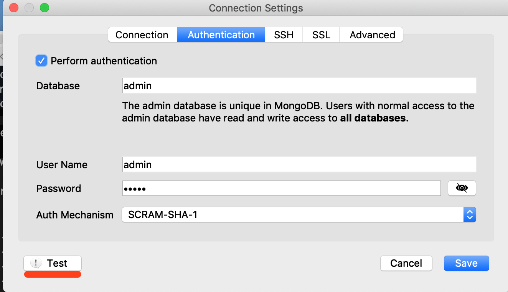
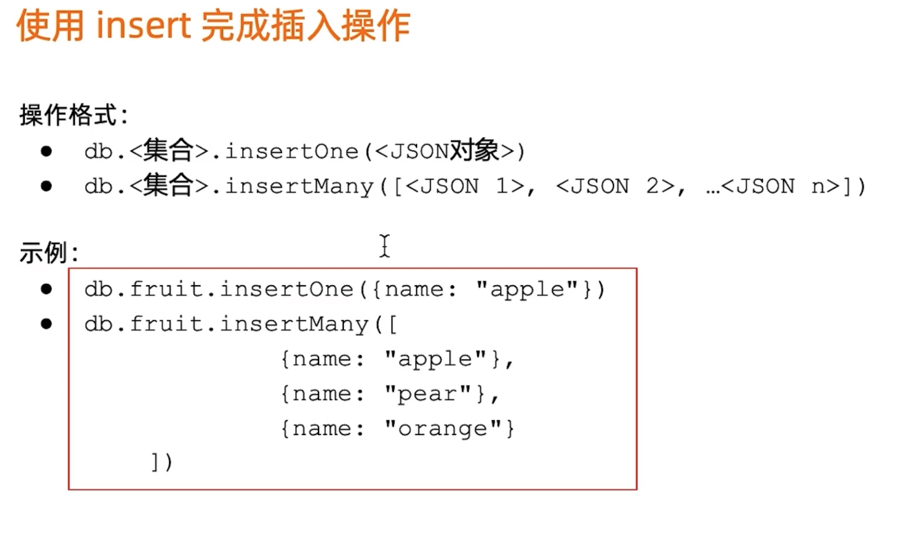
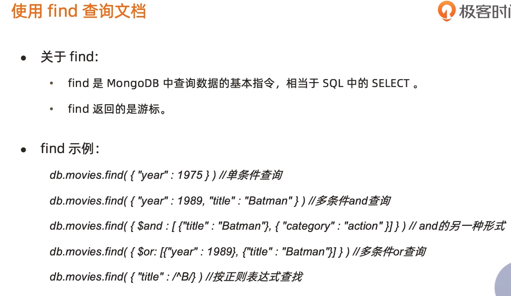
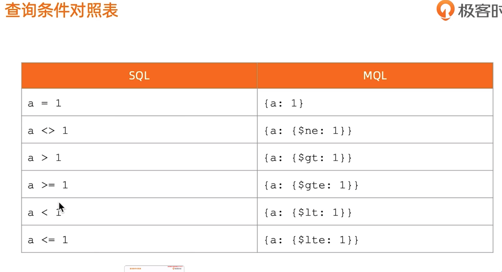
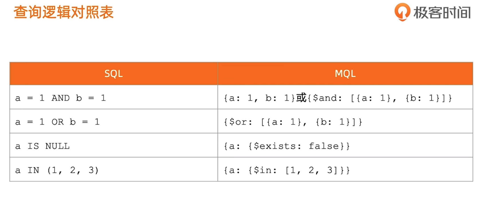
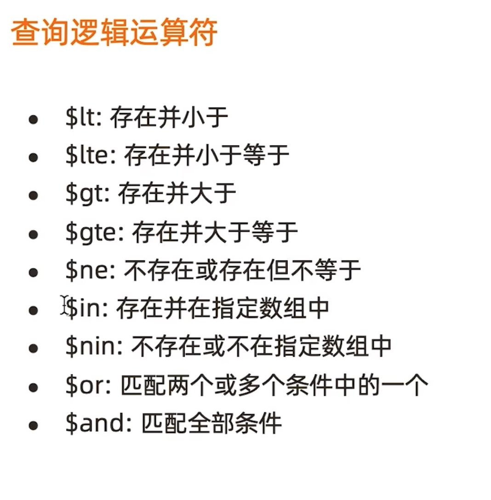
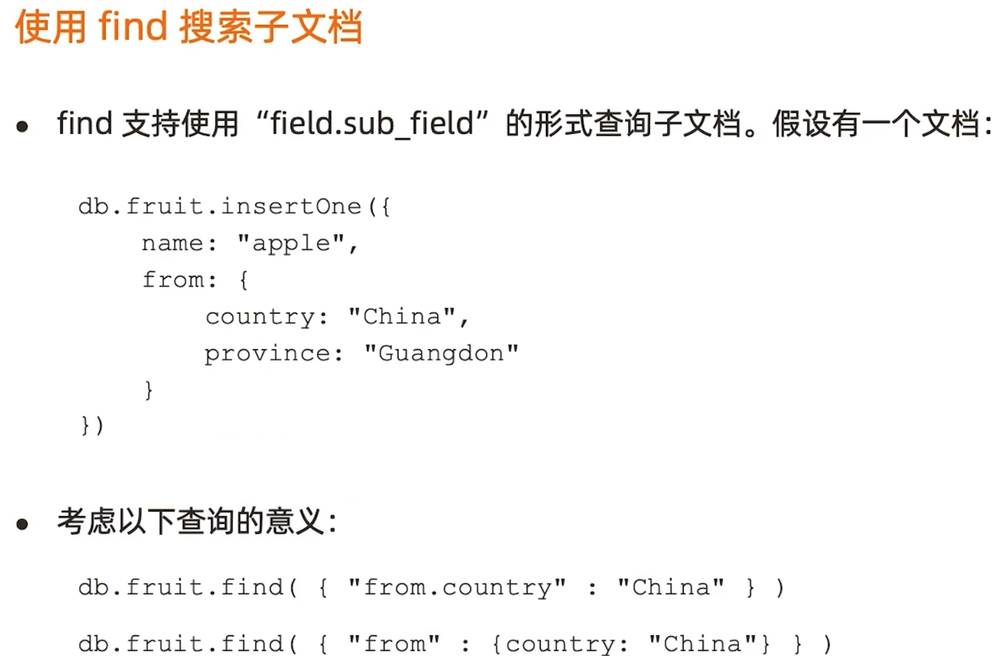

# mongoose

## ORM

-   object relation mappding 对象关系工具
-   把对数据库的操作映射为操作对象

## 安装 mongodb

-   [官方安装 MongoDB 文档](https://docs.mongodb.com/manual/administration/install-community/)

### centos 安装

1. 新增文件`/etc/yum.repos.d/mongodb-org-4.2.repo`。

```
[mongodb-org-4.2]
name=MongoDB Repository
baseurl=https://repo.mongodb.org/yum/redhat/$releasever/mongodb-org/4.2/x86_64/
gpgcheck=1
enabled=1
gpgkey=https://www.mongodb.org/static/pgp/server-4.2.asc
```

2. 通过 yum 安装。

```
sudo yum install -y mongodb-org

# 也可以指定版本
sudo yum install -y mongodb-org-4.2.0 mongodb-org-server-4.2.0 mongodb-org-shell-4.2.0 mongodb-org-mongos-4.2.0 mongodb-org-tools-4.2.0
```

3. yum 会自动升级，要固定软件包，可以在`/etc/yum.conf`里新增下面字段。

```
exclude=mongodb-org,mongodb-org-server,mongodb-org-shell,mongodb-org-mongos,mongodb-org-tools
```

4. 默认情况下，mongodb 会使用 mongod 用户来运行。会新建下面目录：

```bash
# 如果是通过包管理工具安装，下面目录的拥有者和用户组会设置为 mongod
/var/lib/mongo (data数据目录)
/var/log/mongodb (日志目录)
```

5. 启动

```bash
# 启动
sudo service mongod start

# 暂停
sudo service mongod stop

# 重启
sudo service mongod restart

# 开机启动
sudo chkconfig mongod on

# 启动 mongo shell
mongo
```

启动后，`/var/log/mongodb/mongod.log`日志会输出成功，`/etc/mongod.conf`里配置了端口，默认为 27017。

6. 卸载

```bash
# 1. 暂停服务
sudo service mongod stop

# 2. 移除包
sudo yum erase $(rpm -qa | grep mongodb-org)

# 3. 移除数据目录
sudo rm -r /var/log/mongodb
sudo rm -r /var/lib/mongo
```

### mac 安装

1. 提前工作

```
# 1. 安装 homebrew https://brew.sh/#install

# 2. 跳过引导
brew tap mongodb/brew
```

2.  安装 MongoDB

```
brew install mongodb-community@4.2
```

安装后会新增下面文件

```
/usr/local/etc/mongod.conf # 配置
/usr/local/var/log/mongodb # 日志
/usr/local/var/mongodb  # 数据
```

3. 运行

```bash
# 启动
mongod --config /usr/local/etc/mongod.conf

# 安装后就启动
brew services start mongodb-community@4.2

# 连接到 shell
mongo
```

> 如果遇到 ChecksumMismatchError 错误。先删除 .tgz 文件, 再运行下面命令。

```
brew untap mongodb/brew && brew tap mongodb/brew
brew install mongodb-community@4.2
```

### 报错

> Failed to unlink socket file /tmp/mongodb-27017.sock Operation not permitted

是 mongod 没有 tmp 删除权限，手动删除或赋予权限即可。

### Robo 3t 连接

centos 配置如下

1. 开启 27017 端口，详见[CentOS 开放端口的方法](https://www.cnblogs.com/inos/p/10985042.html)。

```
firewall-cmd --zone=public --add-port=27017/tcp --permanent
firewall-cmd --reload
```

2. 配置 `/etc/mongod.conf` 文件，并重启服务

```bash
net:
  port: 27017
  bindIp: 0.0.0.0 # 配置成 0.0.0.0

security:
  authorization: enabled
```

3. 新建 mongod 管理用户，运行`mongo`命令

```bash
# 创建
db.createUser(
  {
    user: "mongodb",
    pwd: "hs15415162",
    roles: [ { role: "readWrite", db: "qinkuaikan" } ]
  }
)

# 验证
db.auth("admin","admin")
```

4. 配置 Robo 3T。



## 使用

```
npm i mongoose
```

```

```

##









## 导入样本

```sh
curl -O -k x.com/x.gz
tar -xvf dump.tar.gz

cd 到 dump 上一层
mongorestore

启动 mongodb
$ mongo
> show dbs
admin   0.000GB
config  0.000GB
eshop   0.000GB
geek    0.000GB
local   0.000GB
mock    0.047GB
test    0.000GB
> use mock
switched to db mock
> show collections
orders
> db.orders.findOne()
```

## 备份

```
>mongodump -h dbhost -d dbname -o dbdirectory
mongodump --host HOST_NAME --port PORT_NUMBER
mongodump --dbpath DB_PATH --out BACKUP_DIRECTORY
mongodump --collection COLLECTION --db DB_NAME
```

## 6.mongo 基本操作
