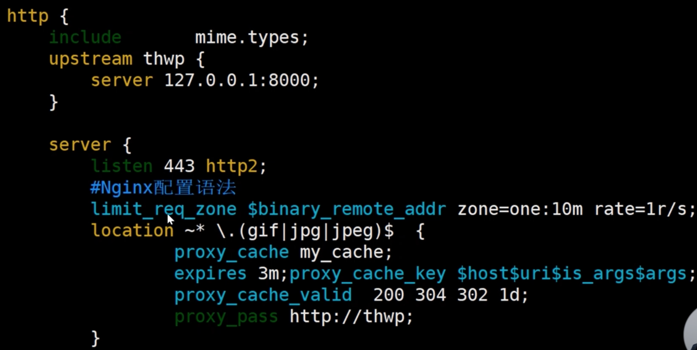

# nginx

3个主要应用场景
- 静态资源服务  
- 反响代理服务
    - nginx强大性能
    - 缓存
    - 负载均衡
- API 服务
    - OpenResty

为什么出现
- 互联网的数据快速增长
    - 互联网的快速普及
    - 全球化
    - 物联网
- 摩尔定律：心跟那个提升
- 低效的 Apache
    - 一个连接对应一个进程

优点
- 高并发，高性能
- 可扩展性好
- 高可靠性
- 热部署
- BSD 许可证

组成
- nginx二进制可执行文件：由各模块源码编译出的一个文件
- nginx.conf 配置文件，控制 nginx 的行为
- access.log 访问日志，记录每一条 http 请求信息
- error.log 错误日志，定位问题

版本发布
- feature
- bugfix
- change

mainline 主干版本
stable 稳定版本

开源版 nginx.org
商业版 nginx.com
阿里巴巴 tengine 不推荐，是 nginx 的分支，但是时间长脱离了。
开源 OpenResty: openresty.ory
商业 OpenResty: openresty.com  技术支持好些

编译nginx
1. 下载
2. 介绍各目录

## nginx配置语法

- 配置文件由指令和指令块构成。
- 每条指令以 ; 分号结尾，指令与参数间以空格符号分隔。
- 指令块以 {} 大括号将多条指令组织在一起。
- include 语句允许组合多个配置文件以提升可维护性。
- 使用 # 符号添加注释，提高可读性。
- 使用 $ 符号使用变量。
- 部分指令的参数支持正则表达式。

时间的单位
- ms
- s 
- m 分钟
- h 时
- d 天
- w 周
- M 月，30天
- y 年，365天

空间的单位
- 默认 bytes
- k/K
- m/M
- G

http 大括号里，表示里面的指令都是 http 模块来解析。

nginx 命令行

nginx -s reload
帮助 -? -h
使用指定的配置文件 -c
指定配置指令 -g
指定运行目录 -p
发送信号 -s   
    - stop 立即停止服务
    - quit 优雅的停止服务
    - reload 重载配置文件
    - reopen 重新开始记录日志文件
- 测试配置文件是否有语法错误 -t -T
- 打印 nginx 版本信息、编译信息 -v -V