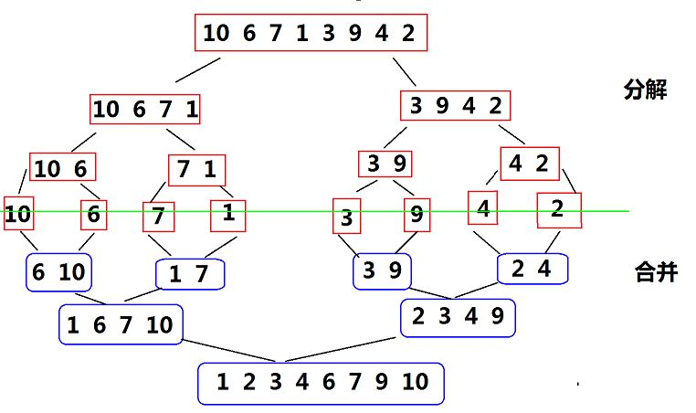

# 归并排序

## 简介

归并排序的思想是将一个数组按照二分的方法分解，分解到最终，每一组只有一个元素。再进行排序合并。

分解合并的时间复杂度是logN(比如8个元素，2分法分解3层结束，即2^3)，对元素排序的时间复杂度是N。所以归并排序时间复杂度是NlogN。



归并排序在合并的时候，常常是采用新开辟一个数组，对其进行填充。这算是一个缺点，因为额外开了一个内存。

合并的方法是：将二分数组左右两边比较，将小的数放到新数组中，完成填充。

## 实现

```javascript
var randomArr = require('./randomArr')

// 这里记住，直接对arr进行填充
function merge(arr, l, mid, r) {
    var aux = arr.slice(l, r + 1)
    var i = l, j = mid + 1;
    for (var k = l; k <= r; k++) {
        // 左边已经全部遍历完
        if (i > mid) {
            arr[k] = aux[j - l]
            j++

        // 右边已经全部遍历完
        } else if (j > r) {
            arr[k] = aux[i - l]
            i++

        // 正常的比较左右两边大小
        } else if (aux[i - l] < aux[j - l]) {
            arr[k] = aux[i - l]
            i++
        } else {
            arr[k] = aux[j - l]
            j++
        }
    }
}

function __mergeSort(arr, l, r) {
    // 如果数组只有一项
    if (l >= r) return

    var mid = Math.floor((l + r) / 2)
    __mergeSort(arr, l, mid)
    __mergeSort(arr, mid + 1, r)

    // 只有左边最大项比右边最小项大时，才合并
    if (arr[mid] > arr[mid + 1]) {
        merge(arr, l, mid, r)
    }
}

// 数组区间是 [l, r]
var mergeSort = (arr) =>{
    var n = arr.length
    __mergeSort(arr, 0, n - 1)
}

mergeSort(randomArr)
```


