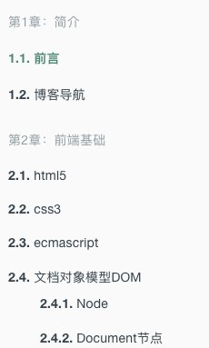
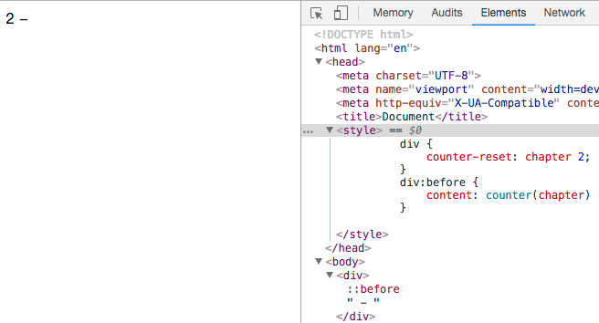
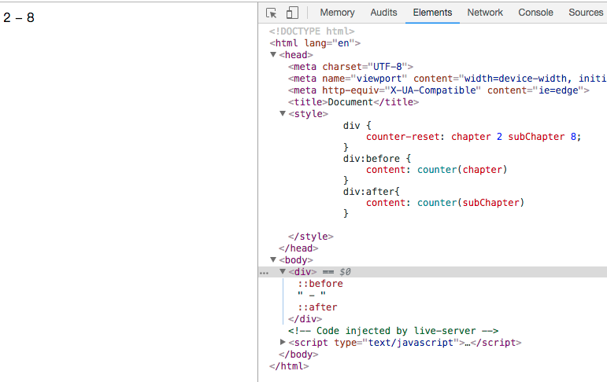
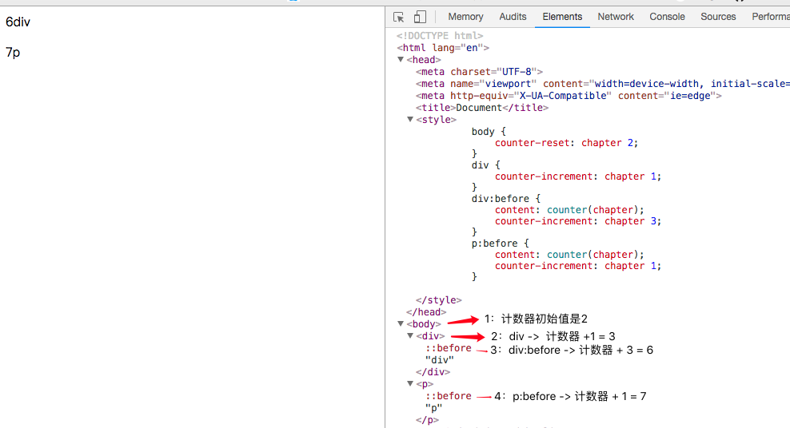
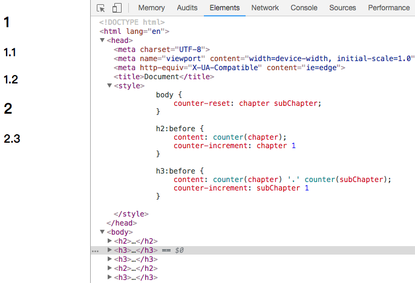

# css计数器

## 简介

今天想将网站左侧导航实现下面这个效果，于是想到了采用css计数器。但是又不太会，特地专门学习一下。



**目标**

1. 掌握counter-reset、counter-increment、counter()、counters()的用法。
2. 将学习资料实践一遍


## 学习资料

- [CSS counter计数器(content目录序号自动递增)详解](http://www.zhangxinxu.com/wordpress/2014/08/css-counters-automatic-number-content/)(都自己动手实践一遍)
- [w3.org counter](https://www.w3.org/TR/CSS2/generate.html#scope)
- [mdn Counters](https://developer.mozilla.org/en-US/docs/Web/Guide/CSS/Counters)
- [Automatic Numbering With CSS Counters](https://dev.opera.com/articles/automatic-numbering-with-css-counters/)

## 属性和方法

css 计数器必须和伪元素的 content 属性一起使用才生效。主要属性如下：

- counter-reset
- counter-increment
- counter()/counters()

### counter-reset

counter-reset 用于指定计数器的名字，还可以设置从哪个数字开始计数(默认是0)。



counter-reset 还可以是负数或小数，但是浏览器都不支持，会当做 0 处理(经测试 chrome 也是当做 0)。

counter-reset 还可以同时命名多个计数器。



### counter-increment

counter-increment 用于定义计数器的递增规则，默认是增加 1。每个元素调用一次，计数器就会增加一次。

```
counter-increment: charpter 3;
```



上图可以看到，计数器是根据 html 从上到下累加计数的。

另外，counter-increment 也可以设置多个计数器的递增规则，可以是负数，表示递减。还可以是 `none` 或 `inherit`：

```
counter-increment: charpter 3 charpter1 -1;
```


### counter()

counter() 方法可以用于显示某个计数器当前的值，最简单的用法就是 `counter(name)`。它还可以传第二个参数，表示 `list-style-type`。

> list-style-type：disc | circle | square | decimal | lower-roman | upper-roman | lower-alpha | upper-alpha | none | armenian | cjk-ideographic | georgian | lower-greek | hebrew | hiragana | hiragana-iroha | katakana | katakana-iroha | lower-latin | upper-latin

```
counter(name, style)
```


counter还支持拼接(级联)。比如：

```
body {
    counter-reset: chapter subChapter;
}

h2:before {
    content: counter(chapter);
    counter-increment: chapter 1
}

h3:before {
    content: counter(chapter) '.' counter(subChapter);  // 级联
    counter-increment: subChapter 1
}
```



上面的代码已经可以显示章节效果了。 

### counters() 

counters() 方法主要用来做嵌套效果。

```
counters(name, string, style)
```

string 表示子序号的连接符，style 表示 list-style-type。

嵌套是根据 counter-reset 来算的，它碰到 counter-reset 就生成一级，如果没有用 counter-reset 的元素嵌套，该元素依然和上一个元素属于同一级。(具体看上面张鑫旭的学习资料)。

## 注意事项

1. 一个元素如果设置了 counter-increment，但是它 display: none/hidden，则计数器不会增加。visibility:hidden 不会有此现象。

2. 应用举例：可以方便用于幻灯片的slide小圆点上。
