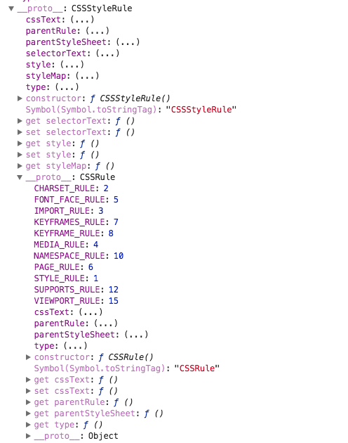

# 操作css

jQuery 中的 .css() 方法功能强大，可读可写。学习本节操作css的目的就是能实现一个 jQuery 版的 css()。

## 学习资料

- [dom css 阮一峰](https://github.com/ruanyf/jstutorial/blob/gh-pages/dom/css.md)

## 样式相关的构造函数

我们写样式有三种形式：行内样式、link标签和style标签。它们的构造函数分别如下：

```js
// CSSStyleDeclaration 的实例
div.style
window.getComputedStyle(div)

// HTMLLinkElement
document.querySelector('link')

// CSSStyleSheet，包含link css文件的相关信息
document.querySelector('link').sheet

// HTMLStyleElement
document.querySelector('style')

// CSSStyleSheet，包含 <style> 标签内 css 的相关信息
document.querySelector('style').sheet

CSSStyleSheet.__proto__ == StyleSheet  // true

// MediaList：css的media属性
document.querySelector('style').sheet.media

// CSSRuleList：css规则列表
document.querySelector('style').sheet.cssRules

// CSSStyleRule：css的每一条规则
document.querySelector('style').sheet.cssRules[0]

CSSStyleRule.__proto__ == CSSRule  // true

// CSSMediaRule：css每一条规则的media
document.querySelector('style').sheet.cssRules[0].media
```

再总结一下：

- 获取的 css 对象是 CSSStyleDeclaration 的实例，比如 div.style 、window.getComputedStyle(div)。
- 通过 .sheet 属性可以获取 link 或 style 的 css 内容对象，它是 CSSStyleSheet 实例。
- css 的内容会被解析为一个类数组 CSSRuleList，每一条规则是一个 CSSStyleRule

了解了上面的内容，接下来就简单了，都是各个构造函数的属性和方法。

## CSSStyleDeclaration

获取元素的样式有下面几种方法：

1. 通过 `Element.style` 。如 `div.style`、`div.getAttribute('style')`等。可以获取和设置行内样式。
2. `window.getComputedStyle()` 可以获取元素计算后属性，第二个参数还支持获取伪元素样式

通过上面两种方法获取的样式对象都是 `CSSStyleDeclaration` 的实例。

注意事项：

- 属性要用驼峰命名，`js`保留字需要在前面加前缀`css`，如 `cssFloat`。
- 获取的属性值都是字符串，设置时必须带单位，如 `divStyle.width = '100px'`。
- `Element.style` 返回的只是行内样式，`window.getComputedStyle()` 获取的是全部样式。

`CSSStyleDeclaration` 的实例属性和方法：
- cssText
- length
- parentRule
- getPropertyPriority()
- getPropertyValue()
- item()
- removeProperty()
- setProperty()

## CSS 模块的侦探

通过判断 typeof style.width 是否是字符串来侦探。如果是字符串类型，则表示支持，如果是 undefined 则表示不支持。

> `style.backgroundColor` 和 `style['background-color']`都可以，但是获取行内样式时不能通过后者，只能是驼峰命名。

```
function isPropertySupported(property) {
  if (property in document.body.style) return true;
  var prefixes = ['Moz', 'Webkit', 'O', 'ms', 'Khtml'];
  var prefProperty = property.charAt(0).toUpperCase() + property.substr(1);

  for(var i = 0; i < prefixes.length; i++){
    if((prefixes[i] + prefProperty) in document.body.style) return true;
  }

  return false;
}

isPropertySupported('background-clip')
// true
```

## CSS 对象

- `CSS.escape()` 用于转义 css 选择器里的特殊字符。

```js
<div id="foo#bar">

document.querySelector('#foo#bar') // null

// 字符串传入 querySelector 之前会先转义一次 \ 变为 '#foo\#bar'，所以要双重转义
document.querySelector('#foo\\#bar')

document.querySelector('#' + CSS.escape('foo#bar'))  // 成功得到div
```

- `CSS.supports()` 表示当前环境是否支持某一句 css 规则。

```
// 写法1
CSS.supports('transform-origin', '5px')  // true

// 写法2
CSS.supports('transform-origin: 5px')  // true
```

## StyleSheet 接口

1. `document.styleSheets` 返回当前页面所有 StyleSheet 实例。
2. 通过 <style> 元素的 sheet 属性获取的对象是 StyleSheet 的实例。

实例属性：

- disabled：样式表是否禁用，可以通过设置 disabled 为 true，

```
// 禁用样式表
<link rel="alternate stylesheet" href="1.css">

// 或
var link = document.querySelector('link')
link.disabled = true
```

- href： 样式表的网址，内嵌样式表是 null。只读属性。
- media：返回一个类数组 MediaList 实例，表示当前样式表适用于哪些媒介。还可以通过 `appendMedium('handheld')`、`deleteMedium('print')` 添加、删除设备。
- title
- type：通常是 `text/css`
- parentStyleSheet：css的@import可以加载其它样式表，parentStyleSheet返回包含当前样式表的父样式表。如果已经是顶层，则返回null。
- ownerNode：返回 StyleSheet 对象所在的 DOM 节点，通常是 <link> 或 <style>。
- cssRules：返回类数组 CSSRuleList 实例。每一项包含一个 css 规则，可以通过 cssText 属性得到对应的 css 字符串。还可以读写具体的那一条 css 命令。

```
styleSheet.cssRules[0].style.color = 'red';
styleSheet.cssRules[1].style.color = 'purple';
```

- ownerRule

**实例方法**

- `insertRule()`
- `deleteRule()`

## CSSStyleRule 和 CSSRule



## css事件

- transitionEnd
    - e.propertyName：发生 transiton 效果的 css 属性
    - e.elapsedTime：transition 持续的秒数，不包含 transition-delay 的时间。
    - e.pseudoElement：如果 transition 发生在伪元素，则返回伪元素的名称，以 :: 开头。如果不发生在伪元素上，则返回空字符串。

- animationstart
- animationend
- animationiteration：开始新一轮动画循环时触发，当 animation-iteration-count > 1 时有效。

- e.animationName：返回动画的 css 属性名。
- e.elapsedTime：动画已经运动的秒数
- animation-play-state 属性可以控制动画的播放和暂停。

```
element.style.webkitAnimationPlayState = "paused";
element.style.webkitAnimationPlayState = "running";
```

