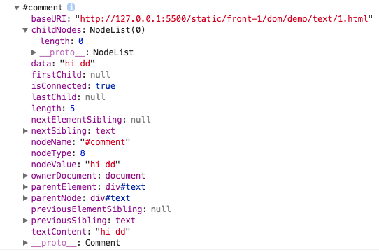

# Text

## 学习资料

- [DOM Text 阮一峰](https://github.com/ruanyf/jstutorial/blob/gh-pages/dom/text.md)

## 获取 Text 节点的方式

下面几种方式都会得到一个文本节点：

1. 注释节点的内容

2. 元素的文本子节点
3. document.createTextNode()
4. new Text()

```
var t = new Text('hi')
t.nodeType // 3
```

## Text 节点的属性

- data 等同于 nodeValue，用来设置或读取文本节点的内容
- wholeText 将当前文本节点与毗邻的文本节点作为一个整体返回。
- length 返回文本节点的长度。
- nextElementSibling、previousElementSibling 如果没有则是 null。

## Text 节点的方法

- appendData(str) 追加文本
- deleteData(start, len) 删除文本
- insertData(start, str) 插入文本
- replaceData(start, len, str) 替换文本
- subStringData(start, len) 获取子字符串
- remove() 移除当前 Text 节点
- splitText(start) 将 Text 节点一分为二。如果分割位置不存在，则报错。返回分割后后面一个字符串。原 Text 节点只包含前面一个字符串。通过父节点的 normalize() 可以合并毗邻的节点。

## DocumentFragment 节点

DocumentFragment 的 parentNode 是 null。

创建的方法有两种：
- document.createDocumentFragment()
- new DocumentFragment()

注意，DocumentFragment节点本身不能被插入当前文档。当它作为appendChild()、insertBefore()、replaceChild()等方法的参数时，是它的所有子节点插入当前文档，而不是它自身。一旦DocumentFragment节点被添加进当前文档，它自身就变成了空节点（textContent属性为空字符串），可以被再次使用。如果想要保存DocumentFragment节点的内容，可以使用cloneNode方法。

DocumentFragment节点对象没有自己的属性和方法，全部继承自Node节点和ParentNode接口。