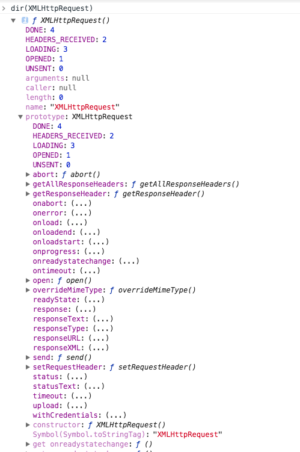

# XMLHttpRequest

1. 首先在控制台执行`dir(XMLHttpRequest)`，返回结果如下图：



## prototype下的属性

**属性**

- responseType
- readyState：表示状态，对应下面五个属性
    - UNSENT : 0，初始化对象，还没有配置连接
    - OPENED : 1，建立连接
    - HEADERS_RECEIVED : 2，发送数据，服务器接受到数据
    - LOADING : 3，正在加载数据
    - DONE:4，数据接受完成，并且可用
- response：根据responseType属性返回的响应体。可以是ArrayBuffer，Blob，Document，js对象或DOMString。如果请求不成功会返回null。有个例外，是responseType=text或''时，readyState还是3时，可能已经包含响应体。
- responseText：在responseType为text或''时获取到文本，如果不是text或''类型，则报错。
- responseXML
- responseURL：比如301后也能得到正确的经过序列化后的url。如果url是null，则返回''。
- status：服务器状态码。在请求完成前，值是0。当然服务器也可能返回0。
- statusText：状态码对应的文本，比如ok，not found。send()前值是空字符串。
- timeout：超时后自动终止
- upload：返回一个XMLHttpRequestUpload对象。可以获取上传对象的进度信息。它包含loadstart，progress，abort，，load，error,timeout,loadend等事件。
- withCredentials：在跨域时是否携带cookie信息(cross-site Access-Control)，默认是false。在同一站点使用该属性无效。

**方法**

- overrideMimeType()：它的作用是重写服务端返回的content-type类型，现在用responseType代替。执行流程是：如果在send后调用，会报错。它首先将mime-type设置为`application/octet-stream`(二进制传输流)。然后看设置的mime是否能解析，如果可以，则覆盖上面的类型。如果有charset参数，则设置override的字符类型。
```
xhr.overrideMimeType('text/plain')
```
- abort()：当一个请求发出后，可以用这个方法中断。当请求中断时，readyState变为0，并且status变为0。在send()后有用，send()前无效。
- open()：用于初始化请求，或重置已经初始化的请求。
- send()：发送请求，如果是get或head请求，请求体设置为null。如果没有设请求头的accept，默认是`*/*`。请求体可以是Blob、BufferSource、FormData、, URLSearchParams, ReadableStream, or USVString object。二进制（文件上传）的发送最好用ArrayBufferView 或 Blob。返回值是undefined。
- setRequestHeader()：用于设置请求头，需要在open()后send()之前调用。如果有几个一样的头，将会合并为一个。
- getAllResponseHeader()：响应头之间用换行符(\n或\r)分割
- getResponseHeader()：参数不区分大小写

**事件**

- onabort：当请求中断时触发
- onerror：发生错误时触发 
- onload：当资源下载完成时触发，比如window.onload。这里表示请求资源加载完成
- onloadend：在资源加载暂停时触发，在error、abort、load时触发。可以用于ajax，或者img和video元素。
- onloadstart：开始下载资源时触发，应用同上。
- onprogress：
- onreadystatechange：readyState改变时触发
- ontimeout：超时时触发
