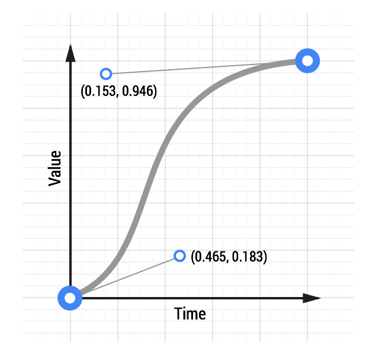

- [谷歌开发者动画手册](https://developers.google.com/web/fundamentals/design-and-ux/animations/?hl=zh-cn)
- [High Performance Animations](https://www.html5rocks.com/zh/tutorials/speed/high-performance-animations/)
- [Accelerated Rendering in Chrome](https://www.html5rocks.com/zh/tutorials/speed/layers/)
- [Antialiasing 101](https://www.html5rocks.com/zh/tutorials/internals/antialiasing-101/)

## 为什么需要动画

1. 动画是使应用吸引人的重要因素，给项目增加活力
2. 用户希望有快速响应和高度交互的用户界面
3. 动画能让交互看起来更加流畅

但是要小心选择动画的属性，有些属性开销很大。卡顿会给用户体验产生负面影响。

不要放一些无用的动画，要有策略的增强用户交互体验。

比如：
如果用户点击菜单图标，滑动以显示抽屉式导航栏，或者点击按钮，则可以使用少量辉光或弹跳来确认交互。避免不必要地打断或妨碍用户活动的动画。

某些属性开销很大，可能让动画卡顿。与改变元素的文本颜色相比，改变元素的 box-shadow 需要开销大很多的绘图操作。同样，改变元素的 width 可能比改变其 transform 要多一些开销。

https://csstriggers.com/
## 创建动画

创建动画的两种主要方法：css 和 javascript。

- 使用 css 动画创建简单的一次性转换，如UI元素状态。
- 需要高级效果(如弹跳、停止、暂停、倒退或减速)时，使用 js。
- 如果使用 js 动画，选用 Web Animations API 或其他框架。

CSS 变换和动画非常适合于从侧面引入导航菜单，或显示工具提示。最后，可以使用 JavaScript 来控制状态，但动画本身是采用 CSS。

如果您需要手动协调整个场景，可直接使用 requestAnimationFrame。这属于高级 JavaScript 方法，但如果您构建游戏或绘制到 HTML 画布，则该方法非常有用。

## css动画

**过渡**

```
// css
.box {
  -webkit-transform: translate(0, 0);
  -webkit-transition: -webkit-transform 500ms;

  transform: translate(0, 0);
  transition: transform 500ms;
}

.box.move {
  -webkit-transform: translate(100px, 100px);
  transform: translate(100px, 100px);
}


// js
box.classList.add('move')；

// 过渡结束事件监听
var box = document.querySelector('.box');
box.addEventListener('transitionend', onTransitionEnd, false);

function onTransitionEnd() {
  // Handle the transition finishing.
}
```

**动画**

```
.box {
  /* Choose the animation */
  animation-name: movingBox;

  /* The animation’s duration */
  animation-duration: 1300ms;

  /* The number of times we want
      the animation to run */
  animation-iteration-count: infinite;

  /* Causes the animation to reverse
      on every odd iteration */
  animation-direction: alternate;
}

@keyframes movingBox {
  0% {
    transform: translate(0, 0);
    opacity: 0.3;
  }

  25% {
    opacity: 0.9;
  }

  50% {
    transform: translate(100px, 100px);
    opacity: 0.2;
  }

  100% {
    transform: translate(30px, 30px);
    opacity: 0.8;
  }
}
```

css动画是声明式，js动画是命令式。

## Web Animation API

```
var target = document.querySelector('.box');
var player = target.animate([
  {transform: 'translate(0)'},
  {transform: 'translate(100px, 100px)'}
], 500);
player.addEventListener('finish', function() {
  target.style.transform = 'translate(100px, 100px)';
});
```

## 缓动

自然界物体都是加减速的，没有匀速。做动画要根据这个规律。

- UI元素选择换出动画
- 避免缓入或缓入缓出动画，因为这类动画会让用户感觉迟钝

css中的关键字

- linear
- ease-in
- ease-out
- ease-in-out

还可以使用steps关键字，可缓解离散步骤的变换。

自定义缓动函数 cubic-bezier



```
transition: transform 500ms cubic-bezier(0.465, 0.183, 0.153, 0.946);
```

前两个数字是第一个控制点的 X 和 Y 坐标，后两个数字是第二个控制点的 X 和 Y 坐标。

为 UI 元素使用缓出动画；Quintic 缓出是一个非常好（虽然比较快速）的缓动。
一定要使用动画持续时间；缓出和缓入应为 200 毫秒 - 500 毫秒，而弹跳和弹性缓动的持续时间应更长，为 800 毫秒 - 1200 毫秒。

一般来说，缓出将是正确的选择，当然也是很好的默认选择。它开头较快，使动画有反应快速的感觉，这一点很受欢迎，但在结尾有一个不错的减速。
https://easings.net/zh-cn#

其他缓动公式应谨慎使用，特别是弹跳或弹性缓动，并且仅在适合于项目时才使用。很少有东西会像不协调的动画那样让用户体验很差。如果您的项目不是为了追求乐趣，那么就无需使元素在 UI 周围进行弹跳。相反，如果您将要创建一个轻松欢乐的网站，那么请务必使用弹跳！

缓出：约 200 毫秒 - 500 毫秒。这让眼睛有机会看到动画，但不会觉得卡顿。
缓入：约 200 毫秒 - 500 毫秒。请记住，它在结尾将晃动，没有时间量变化将缓和这种影响。
弹跳或弹性效果：约 800 毫秒 - 1200 毫秒。您需要留出时间让弹性或弹跳效果“停下”。若没有这点额外时间，动画的弹性跳动部分看上去比较有攻击性，让人感觉不舒服。

## 在视图之间设置动画

您常常需要让用户在应用的各视图之间切换，不管是从列表换到详情视图，还是显示边栏导航。在这些视图之间设置动画可以吸引用户，并让您的项目更生动活泼。


使用变换来切换不同视图；避免使用 left、top 或任何其他会触发布局的属性。
确保使用的所有动画简洁明快，并且设置较短的持续时间。
考虑在屏幕尺寸增大时您的动画和布局如何变化；考虑哪些适合小屏幕的动画用在桌面环境时可能看起来很怪。

## 模态框

- 谨慎使用模态框，如果不必要的打断用户的体验，用户会感到失望。
- 加上缩放可实现不错的掉落效果。用户关闭。
- 关闭时，应迅速清除，进入时应慢速，以防止用户感到突然。

## 不对称的动画定时

不对称的动画定时可让您在表达个性的同时快速响应用户交互，从而提升用户体验。还能使感觉出现对比，使界面在视觉上更吸引人。
经验法则是始终快速响应用户交互。

例如，当用户进行点按以显示边栏导航时，您应当尽快显示此导航，持续时间约 100 毫秒。但是，当用户清除菜单时，您可以让视图动画离开得慢一点，即大约 300 毫秒。

相比之下，在显示模态视图时，一般是显示错误或一些其他关键消息。在这种情况下，要慢一点显示视图，同样大约为 300 毫秒，但是在进行清除（由用户触发）时，应非常迅速地完成。

一般的经验法则为：

对于用户交互触发的 UI 动画，例如视图变换或显示元素，采用快速前奏（短持续时间）和慢速结尾（较长持续时间）。
对于由代码触发的 UI 动画，例如错误或模态视图，采用较慢前奏（较长持续时间）和快速结尾（短持续时间）。


## 动画与性能

- 注意您的动画不能导致性能问题；确保了解对指定 CSS 属性设置动画的影响。
- 改变页面（布局）结构或导致绘图的动画属性特别消耗资源。
- 尽可能坚持改变变形和透明度。
- 使用 will-change 来确保浏览器知道您打算对什么设置动画。

应尽可能避免给触发布局或绘制的属性设置动画。对于大部分现代浏览器，这意味着将动画限制为 opacity 或 transform，两种都可经浏览器高度优化；

使用 will-change 属性
使用 will-change 来确保浏览器知道您打算改变元素的属性。这使浏览器能够在您做出更改之前进行最合适的优化。但是，请勿过度使用 will-change，因为过度使用可能导致浏览器浪费资源，进而引起其他性能问题。

一般经验法则是，如果动画可能在接下来的 200 毫秒内触发（由用户交互触发或由应用的状态触发），则对动画元素使用 will-change 是个好主意。

CSS 对比 JavaScript 的性能
网络上有很多网页和评论从性能的角度讨论了 CSS 和 JavaScript 动画的相对优点。以下是要记住的几个要点：

基于 CSS 的动画以及原生支持的网络动画通常由一个名为“合成器线程”的线程处理。这不同于在其中执行样式、布局、绘制和 JavaScript 的浏览器“主线程”。这意味着，如果浏览器正在主线程上运行一些高开销任务，则这些动画可以继续运行而不中断。

在许多情况下，变形和透明度的其他更改还可由合成器线程来处理。

如果任何动画触发绘制、布局或同时触发这两者，则“主线程”将必须执行工作。这点同时适用于基于 CSS 和 JavaScript 的动画，并且布局或绘制的开销可能拖慢与 CSS 或 JavaScript 执行相关的任何工作，使问题变得无意义。


