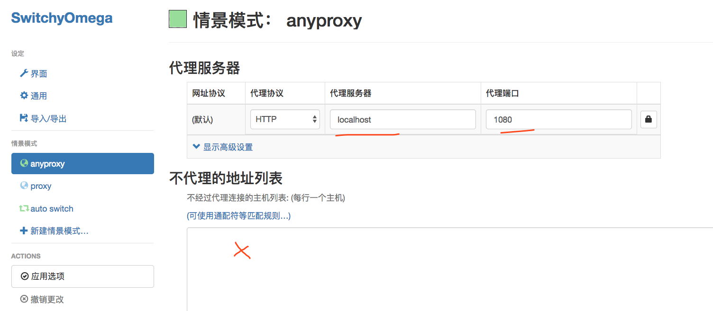
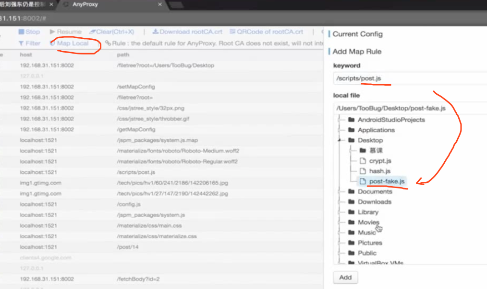

# web安全

1. 私密性：资料不被非法获取和利用
2. 可靠性：不丢失、不损坏、不篡改

如何保证

- 代码层面
- 架构层面
- 运维层面

安全问题
用户身份被盗用
用户密码泄露
用户资料被盗取
网站数据库泄露等

重要性

跨站脚本攻击xss
跨站请求伪造csrf
cookie安全
点击劫持攻击
传输过程安全
用户密码安全
SQL注入攻击
信息泄露和社会工程学
其它安全问题

## 跨站脚本攻击XSS

跨站脚本攻击：`cross site scripting`。

跨站是指不是来自本站的脚本，即用户提交或第三方脚本。xss原理是：程序 + 数据 = 结果。script由数据变成了程序。

1、比如参数带脚本，后端直接返回了，而没有处理。

```javascript
// ?from=<script src='http://www.xx.com/jquery.js'></script>

// 后端模板
<div>{from}</div>
```

xss能干什么？

- 获取页面数据。
- 获取cookie
- 劫持前端逻辑
- 发送请求

也就可以偷取网站任意资料，用户资料，密码和登录态，欺骗用户

2、评论时富文本编辑器，然后其它用户访问评论也会中招

3、用户下单评论或其它操作，后台用户进入查看，这时脚本运行，可以得到后台管理员的cookie和网址，然后登录。

xss攻击分类

反射型：url参数直接注入，危害小些，因为用户可能会察觉到。不过攻击者可能用短网址
存储型：会存储到数据中，相比危害更大

xss攻击注入风险点
- html节点内容
- html属性
- javascript代码
- 富文本


## cookies问题

cookies特性
- 前端存储数据
- 后端通过http头设置
- 请求时通过http头传给后端
- 前端可读写
- 遵守同源策略：协议、域名、端口一致
- 域名：只能使用自己域名下的
- 有效期：默认是Session，会话结束就到期
- 路径
- http-only：cookie只能被http使用，即只能被后端读写。前端不能使用
- secure：https时才能使用

```javascript
document.cookie
```

cookies作用
- 存储个性化设置
- 存储未登录时用户唯一标识
- 存储已登录用户的凭证
- 存储其它业务数据

存储已登录用户的凭证

1、用户ID，下次根据id来识别用户，cookie容易被篡改，模拟其它用户登录

2、用户ID + 签名，这个签名只有后端能算出来。签名是不可逆的。cookie内容有userId，sign，后端拿到userId再签名和sign进行对比即可。

```javascript
const KEY = 'fjas3&#11fdjsk'  // 私钥
crypt.cryptUserId = function(userId){
    var crypto = require('crypto')
    var sign = crypto.createHmac('sha256', KEY)
    sign.update(userId + '')
    return sign.digest('hex')
}
```

3、SessionId(持久化，可存文件或数据库中)：服务端返回一个随机数，根据随机数判断用户，cookie没有用户可识别的信息。黑客不知道怎么修改。

Cookies和XSS的关系
- XSS可能偷取Cookies
- http-only的cookies不会被偷

Cookies和CSRF的关系
- CSRF利用了用户Cookies
- 攻击站点无法读写Cookies
- 最好能阻止第三方读取Cookies

Cookies安全策略
- 签名防篡改(对明文进行签名)
- 私有变换(加密)(对字符串进行加密)，crypto.createCipher()、crypto.createDecipher()
- http-only(防止XSS)
- secure：https
- same-site:只支持 chrome


## 点击劫持clickjacking

用户打开黑客网站，网站实际有个透明的`iframe`，点击界面实际是操作的这个iframe里的内容。

特点：
- 用户亲手操作
- 用户不知情

危害：
- 可以获取用户资金（转账、消费）
- 获取用户敏感信息

防控：
- 防止被内嵌为iframe

```javascript
if(top != window){ top.location = window.location}
```

html5添加了 sandbox 用来限制 iframe 的权利。值为`allow-forms`时，表单能提交，iframe的脚本不会执行。

```javascript
// 又可以被劫持了
<iframe sandbox="allow-forms">
```

- 设置响应头`X-Frame-Options`：用于设置 iframe 是否能被内嵌
    - DENY: 不允许内嵌
    - SAMEORIGIN: 同域
    - ALLOW-FROM uri：指定来源
- 其它辅助手段：让用户知情，比如验证码。


例子：比如点击一个表面显示是“播放”某个视频的按钮，而实际上完成的操作却是将用户的社交网站个人信息改为“公开”状态。


## 传输安全

### http

http传输是明文的，所以数据在浏览器和服务端传输中(路由，防火墙等)很容易被窃听和篡改。

`traceroute`命令用于追踪数据包在网络上的传输时的全部路径，它默认发送的数据包大小是40字节。

```bash
traceroute www.baidu.com
```

比如用【[anyproxy](http://anyproxy.io/cn/)】做代理，发送的请求都是由其代理了，它就可以知道发送的请求数据和返回的数据。而且可以篡改数据。


`Map Local`用来将原来的文件替换为本地文件(即篡改)。新版本是通过rule模块来实现。

实践操作步骤:
1. npm 安装 anyproxy，并执行`anyproxy --port 1080`。
2. 按照 chrome 插件 SwitchyOmega，设置并切换 anyproxy。



3. 浏览器打开`http://127.0.0.1:8002/`可以看到代理的请求。
4. 写个 html 页面，将里面的 js 通过 [rules 模块](http://anyproxy.io/cn/#rule%E6%A8%A1%E5%9D%97)进行篡改。



窃听的问题：
- 窃听密码
- 窃听敏感信息
- 获取非法资料

篡改的问题：
- 插入广告
- 重定向网站
- 无法防御 XSS 和 CSRF 攻击，因为可以随意篡改。

案例：
- 运营商劫持等


### https

1. 对数据进行加密防止窃听。即TLS(SSL)加密，就是对数据进行加密。
2. 为了防止中间人篡改，需要加信任机制（证书），即浏览器数据确定发送给了服务器，服务器也是返回给了浏览器。


- 证书无法伪造，由 CA(Certificate Authorities) 分发。 中间人给假证书到客服端是无法通过验证的。如果CA不受信任，则会标记为不安全。
- 证书的私钥不能被泄露。
- 域名的管理权不能泄露，CA颁发证书会验证，如果域名被控制，则实际发给了该服务器。
- CA坚守原则。

可以修改证书为不受信任，浏览器会将它标记为不受信任，https会标记为不安全，警告您的链接不是私密的。

如果将不受信任的CA改为信任，则它可能会给假 taobao 网站颁发证书，访问时也会有被窃听或篡改。

申请证书：[https://letsencrypt.org/](https://letsencrypt.org/getting-started/)

有自动脚本。acme.sh


## 密码安全

密码的存储
- 严禁明文存储(防泄露)
- 单向变换(防泄露)，密码能得到密文，密文得不到密码。
    - 哈希算法：
        - 明文和密文是一一对应的。
        - 雪崩效应：明文不一样，密文完全不一样。不能猜
        - 密文明文无法反推
        - 密文固定长度
        - 常见哈希算法：md5、sha1、sha256
        - 数据库足够大后，可以反推(彩虹表)。不过我们可以将算法组合和增加密码复杂度。比如`md5(md5(明文))`、`md5(sha256(sha1(明文)))`。
- 变换复杂度要求(防猜解)
- 密码复杂度要求(防猜解)
- 加盐(防猜解)：如果用户密码很简单，我们可以为每个用户加随机不同的内容，帮用户加强复杂度。比如

```
md5(sha1(md5(ID + ab83kd + 原始密码 + 81kdso + 盐 + 1lso;$2)))
```

密码变换次数越多越安全
- 加密成本几乎不变(生成密码速度慢一些)
- 彩虹表失效
- 解密成本增大N倍


密码传输的安全
- https传输
- 频率限制(防止一个个尝试)
- 前端加密意义有限。防止原始密码泄露，可以防止用户其它网站的密码泄露。如果黑客在服务端窃听，前端对每个用户加密不同，可以防止用户的密码被破解。

前端加密，传到后端。

```
// 前端
data.password = md5(data.username + SUGAR + data.password)

// 后端改造 将数据库的原始密码进行同样操作后，和前端传来的密码对比
```

**生物特征密码**
- 指纹、唇纹
- 声纹
- 虹膜
- 人脸

生物特征问题
- 私密性 - 容易泄露，比如指纹,到处都会留指纹
- 安全性 - 碰撞。是概率性的，不可靠。比如脸相似，或受伤了
- 唯一性 - 终身唯一。无法修改。比如泄露了，改不了密码

目前技术不太可靠。


## 信息泄露

- 泄露系统敏感信息
- 泄露用户敏感信息
- 泄露用户密码

信息泄露的途径
- 错误的信息失控，比如调试时
- SQL注入
- 水平权限控制不当
- XSS、CSRF

社会工程学：可以通过昵称找手机号、身份证、真名等，挖掘一个人的信息。再进行诈骗等操作。账号被盗诈骗。

案例
- 电信诈骗（徐玉玉案）
- 伪装公检法
- qq视频借钱
- 微信伪装好友，比如头像名称换成好友的

oAuth思想
- 一切行为由用户授权
- 授权行为不泄露敏感信息
- 授权会过期

用户登录从敏感资料服务器获取票据，然后用户和业务服务器交互，每次发送票据。业务获取数据时，用票据请求数据，再返回给用户。这样，业务不能随便拿数据，必须用户授权通过票据才能拿到数据，业务开发人多，泄露风险小。而且查数据是可以统计的。可以防止批量查询，和敏感信息的查询。


