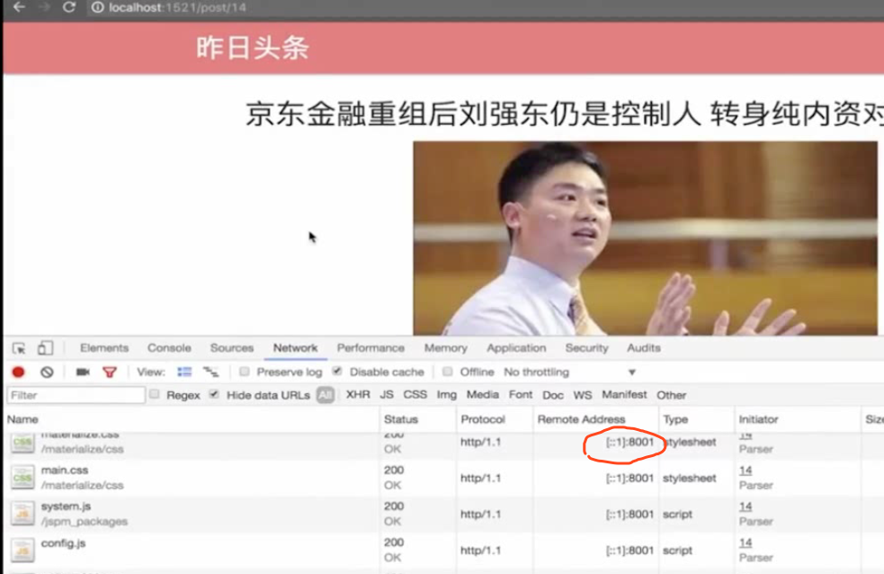
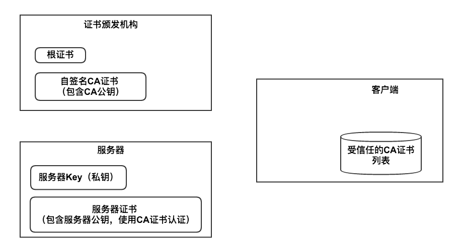

# web安全

1. 私密性：资料不被非法获取和利用
2. 可靠性：不丢失、不损坏、不篡改

如何保证

- 代码层面
- 架构层面
- 运维层面

安全问题
用户身份被盗用
用户密码泄露
用户资料被盗取
网站数据库泄露等

重要性

跨站脚本攻击xss
跨站请求伪造csrf
cookie安全
点击劫持攻击
传输过程安全
用户密码安全
SQL注入攻击
信息泄露和社会工程学
其它安全问题

## 跨站脚本攻击XSS

跨站脚本攻击：`cross site scripting`。

跨站是指不是来自本站的脚本，即用户提交或第三方脚本。xss原理是：程序 + 数据 = 结果。script由数据变成了程序。

1、比如参数带脚本，后端直接返回了，而没有处理。

```javascript
// ?from=<script src='http://www.xx.com/jquery.js'></script>

// 后端模板
<div>{from}</div>
```

xss能干什么？

- 获取页面数据。
- 获取cookie
- 劫持前端逻辑
- 发送请求

也就可以偷取网站任意资料，用户资料，密码和登录态，欺骗用户

2、评论时富文本编辑器，然后其它用户访问评论也会中招

3、用户下单评论或其它操作，后台用户进入查看，这时脚本运行，可以得到后台管理员的cookie和网址，然后登录。

xss攻击分类

反射型：url参数直接注入，危害小些，因为用户可能会察觉到。不过攻击者可能用短网址
存储型：会存储到数据中，相比危害更大

xss攻击注入风险点
- html节点内容
- html属性
- javascript代码
- 富文本


## 传输安全

### http

http传输是明文的，所以数据在浏览器和服务端传输中(路由，防火墙等)很容易被窃听和篡改。

`traceroute`命令用于追踪数据包在网络上的传输时的全部路径，它默认发送的数据包大小是40字节。

```bash
traceroute www.baidu.com
```

比如用【[anyproxy](http://anyproxy.io/cn/)】做代理，发送的请求都是由其代理了，它就可以知道发送的请求数据和返回的数据。而且可以篡改数据。



`Map Local`用来将原来的文件替换为本地文件(即篡改)。新版本是通过rule模块来实现。

实践操作步骤:
1. npm 安装 anyproxy，并执行`anyproxy --port 1080`。
2. 按照 chrome 插件 SwitchyOmega，设置并切换 anyproxy。


3. 浏览器打开`http://127.0.0.1:8002/`可以看到代理的请求。
4. 写个 html 页面，将里面的 js 通过 [rules 模块](http://anyproxy.io/cn/#rule%E6%A8%A1%E5%9D%97)进行篡改。


窃听的问题：
- 窃听密码
- 窃听敏感信息
- 获取非法资料

篡改的问题：
- 插入广告
- 重定向网站
- 无法防御 XSS 和 CSRF 攻击，因为可以随意篡改。

案例：
- 运营商劫持等


### https

1. 对数据进行加密防止窃听。即TLS(SSL)加密，就是对数据进行加密。
2. 为了防止中间人篡改，需要加信任机制（证书），即浏览器数据确定发送给了服务器，服务器也是返回给了浏览器。



- 证书无法伪造，由 CA(Certificate Authorities) 分发。 中间人给假证书到客服端是无法通过验证的。如果CA不受信任，则会标记为不安全。
- 证书的私钥不能被泄露。
- 域名的管理权不能泄露，CA颁发证书会验证，如果域名被控制，则实际发给了该服务器。
- CA坚守原则。

可以修改证书为不受信任，浏览器会将它标记为不受信任，https会标记为不安全，警告您的链接不是私密的。

如果将不受信任的CA改为信任，则它可能会给假 taobao 网站颁发证书，访问时也会有被窃听或篡改。


