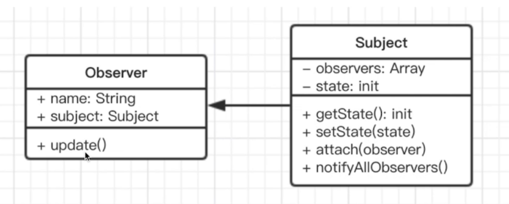

# 发布订阅模式

## 学习资料

- [设计模式（三）：观察者模式与发布/订阅模式区别](http://www.cnblogs.com/lovesong/p/5272752.html)
- [观察者模式和发布订阅模式有什么不同？](https://www.zhihu.com/question/23486749)




## 实现

```javascript
class Subject {
    constructor() {
        this.state = 0
        this.observers = []
    }

    getState() {
        return this.state
    }

    setState(state) {
        this.state = state
        this.notifyAllObserver()
    }

    notifyAllObserver() {
        this.observers.forEach(observe => {
            observe.update()
        })
    }

    attach(observer) {
        this.observers.push(observer)
    }
}

class Observer {
    constructor(name, subject) {
        this.name = name
        this.subject = subject
        this.subject.attach(this)
    }

    update() {
        console.log(`my name is ${this.name},subject state is ${this.subject.getState()}`)
    }
}

const s = new Subject()
const o1 = new Observer('o1', s)
const o2 = new Observer('o2', s)

s.setState(1)
s.setState(2)
```

当发布者发布消息，即调用`s.setState()`时，观察者会受到消息。


## 场景

- 网页事件绑定：点击按钮的时候触发绑定的事件
- Promise

```javascript
result.then(()=>{
    // then这里是绑定，等到promise pending状态变化时触发
}).then()
```

- jQuery callbacks
```javascript
var callbacks = $.Callbacks()
callbacks.add(function(info){console.log(info)})  // fire
callbacks.fire('fire')
```

- 自定义事件

```javascript
const EventEmitter = require('events').EventEmitter
const emitter = new EventEmitter()
emitter.on('end', function(){
    console.log('hi')
})
emitter.emit('end')

// 2
class Person extends EventEmitter{

}
let p = new Person()
p.on('talk', ()=>{})
p.emit('talk')

// 3、坏处是可能不是一行一行的读
var fs = require('fs')
var readStream = fs.createReadStream('./1.txt')
var length = 0
readStream.on('data', function(chunk){
    length += chunk.toString().length
})
readStream.on('end',function(){
    console.log(length)
})

// 4、一行行的读，利用readline
var readline = require('readline')
```

- nodejs中：处理 http 请求，多进程通讯
- vue 和 react 组件生命周期触发
- vue watch

## 总结

观察者模式是主题和观察者分离解耦。不是主动触发，而是被动监听。
