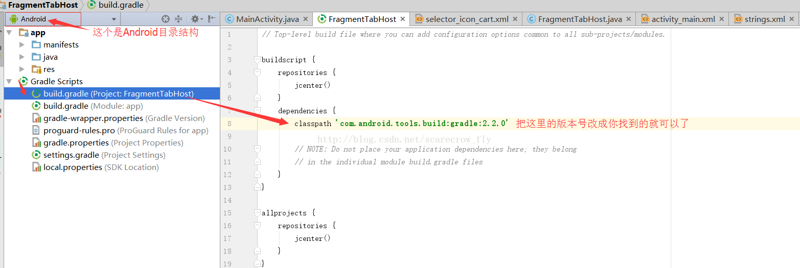

# Android Studio

## 导入第三方库

1. 将主项目作为依赖导入到新的项目中。

修改 AndroidManifest.xml

```xml
<!--  注释掉icon和theme
        android:icon="@mipmap/ic_app"
        android:theme="@style/AppTheme"
-->
<application
    android:name=".MyApplication"
    android:allowBackup="true"
    android:label="@string/app_name"
    android:supportsRtl="true"
    >
```

## Error:Unknown host 'android.oa.com'. You may need to adjust the proxy settings in Gradle.

将 build.gradle里的代理去掉

## 使用Genymotion模拟器

在android studio里设置插件，搜索genymotion，然后在最下面配置它的路径，重启 genymotion。


## 本地安装gradle-3.3-all.zip

先手动下载 [gradle包](http://services.gradle.org/distributions/)。然后修改`{project.dir}\gradle\wrapper\gradle-wrapper.properties`文件。

```
# distributionUrl=https\://services.gradle.org/distributions/gradle-2.2.1-all.zip
distributionUrl=gradle-2.2.1-all.zip
```

## unspecifie don project app resolves to an APK archive which is not support

出现这个问题是一个 libraryA 依赖另一个 libraryB 导致，需要修改 libraryB 的 build.gradle。

```
// 原
# apply plugin:'com.android.application'

// 修改为
apply plugin:'com.android.library'
```

改完编译，还会包下面一个错误 `Library projects cannot set applicationId. applicationId is set to 'com.tencent.qcloud.timchat' in default config.`。

还需要将 `android -> defaultConfig` 的 application 删除。

参考：[How to import android project as library and NOT compile it as apk (Android studio 1.0)](https://stackoverflow.com/questions/27536491/how-to-import-android-project-as-library-and-not-compile-it-as-apk-android-stud)

## 需要常量表达式case R.id.beauty_seekbar

将一个主工程作为依赖工程，给另一个新的主工程使用时，报了这个错误。


需要将 switch 语句替换成 if。如下：

```
// 原来
int id = view.getId();
switch (id) {
    case R.id.button1:
        action1();
        break;
    case R.id.button3:
        action3();
        break;
}

// 替换为
int id = view.getId();
if (id == R.id.button1) {
    action1();
} else if (id == R.id.button3) {
    action3();
}
```

在 android studio中可以使用快捷方式将 switch 语句换成 if 语句，方法是 `鼠标选中 switch 单词 ->  按 alt + enter -> 点击replace switch with if`。

参考：[Non-constant Fields in Case Labels](http://tools.android.com/tips/non-constant-fields)


## Manifest merger failed with multiple errors, see ？

- [Manifest merger failed with multiple errors, see](https://www.zhihu.com/question/36645628)


## 手机安装app出现多个图标

查看AndroidManifest.xml去掉下面代码。
```
<category android:name="android.intent.category.LAUNCHER" />
```

## rn跳转到原生

https://www.cnblogs.com/shen076/p/6380034.html

https://blog.csdn.net/csdn_aiyang/article/details/78397409?fps=1&locationNum=10


## 'Couldn't follow symbolic link' when testing release build for Android

```
rm -rf node_modules && npm install
```


## 添加依赖库

点击菜单中的“项目结构（倒数第四个 project construct）”图标按钮，或者快捷键`cmd + ;` 。

- [Android Studio 添加依赖库三种方式](https://www.jianshu.com/p/554900684447)


## 解决“Cannot merge new index xxx into a non-jumbo instruction”的问题

使用Gradle构建的，在模块的build.gradle里配置：

```
android {

    // 添加
    dexOptions {
        jumboMode true
    }
}
```

之后可能会报错：`method ID not in [0, 0xffff]: 65536`。需要在build.gradle文件里添加：

```
android {
    defaultConfig{
        ...
        multiDexEnabled true  // 添加
    }
}
```

- [Android Studio 遇到 “method ID not in [0, 0xffff]: 65536” error](https://blog.csdn.net/zouchengxufei/article/details/49996717)

## java.lang.OutOfMemoryError: GC overhead limit exceeded

意思是电脑内存、CPU占用太大了。

- [Error java.lang.OutOfMemoryError: GC overhead limit exceeded](https://stackoverflow.com/questions/1393486/error-java-lang-outofmemoryerror-gc-overhead-limit-exceeded)


## Duplicate files copied in APK lib/armeabi-v7a/libgnustl_shared.so

在主项目的`grade.build`里添加：

```
android {
    packagingOptions {
        pickFirst 'lib/armeabi-v7a/libgnustl_shared.so'
        pickFirst 'lib/arm64-v8a/libgnustl_shared.so'
        pickFirst 'lib/x86_64/libgnustl_shared.so'
        pickFirst 'lib/x86/libgnustl_shared.so'
    }
}
```

- [How to fix the libgnustl_shared.so file duplicated which in third party sdks?](https://stackoverflow.com/questions/37200853/how-to-fix-the-libgnustl-shared-so-file-duplicated-which-in-third-party-sdks/39584838#39584838)

## Error:Could not download gradle-core.jar (com.android.tools.build:gradle-core:2.3.3): No cached version available for offline mode

1. 打开android studio安装目录对应的目录`C:\Program Files\Android\Android Studio\gradle\m2repository\com\android\tools\build\gradle`。
2. 修改下面文件




参考 [Gradle版本号不匹配导致的错误解决办法](https://blog.csdn.net/scarecrow_fly/article/details/77949905)


## JAVA_HOME配置

- [Installing the JDK Software and Setting JAVA_HOME](https://docs.oracle.com/cd/E19182-01/820-7851/inst_cli_jdk_javahome_t/)


## adb不是内部命令

**windows系统**
将android studio sdk目录打开，`C:\Users\banli17\AppData\Local\Android\sdk\platform-tools`。里面有个adb.exe文件。 将它配置成环境变量。

**mac系统**

```bash
// 方法1，全局生效
vim /etc/profile
export PATH=$PATH:/Users/banli/Library/Android/sdk/platform-tools
source /etc/profile

// 方法2，用户生效
sudo vim ~/.bash_profile
export PATH=$PATH:/Users/banli/Library/Android/sdk/platform-tools
source ~/.bash_profile
```

## Error 'Could not determine java version from ‘10’

回退到[java8](http://www.oracle.com/technetwork/java/javase/downloads/jdk8-downloads-2133151.html)。


## React Native android build failed. SDK location not found

在android目录新建`local.properties`，添加sdk地址(Android studio sdk里面有)。

```
sdk.dir = /Users/USERNAME/Library/Android/sdk
```

## "application" 相关联的属性 "tools:replace" 的前缀 "tools" 未绑定
