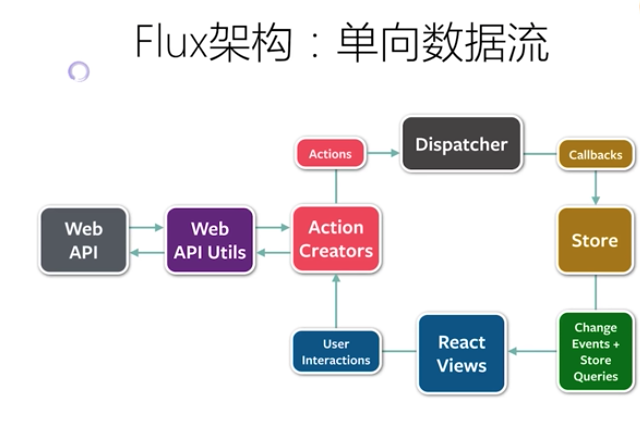

# react 实战进阶

https://doc.react-china.org/docs/thinking-in-react.html

## 历史背景和特点

因为 facebook 的一个消息需求上线后经常出现 bug。

- 传统 dom api 关注太多的细节。
- 应用程序状态分散，难以追踪和维护。

思想
- 始终整体刷新页面，前后是2个状态，状态变化后，自动进行更新。只需要关系状态。

例如，有个新消息要插入界面，jquery 需要创建节点，插入。但是 react 关心的是将消息展现在 UI 上。消息条数变化，就自动更新了。

特点：
- 1个新概念：组件
- 4个必须API
- 单向数据流
- 完善的错误提示

React 解决了 UI 细节问题，还有数据模型的问题。

传统数据模型 MVC 难以扩展和维护，难以追踪是M 还是 V 发生错误。

提出了 flux 架构：单向数据流。




## 组件化方式思考 UI 构建

```
props + state -> view
```

- react组件一般不提供方法，而是某种状态机。
- react组件可以理解是一个纯函数。
- 单向数据绑定，数据一定是 props 传入。

### 受控组件和非受控组件

受控组件内部没有状态，状态由使用者维护。

```
// 受控组件
<input
    type="text"
    value={this.state.value}
    onChange={(e)=>{
        this.setState({
            value: e.target.value
        })
    }}
/>
```

非受控组件内部维护状态，使用者需要使用 ref 来获取。

```
// 非受控组件
<input
    type="text"
    ref={node => this.input = node}
/>
```

创建组件的原则：单一职责原则。
1. 每个组件只做一件事。
2. 如果组件变得复杂，那么应该拆分成小组件。当改变状态时，大组件会整个刷新，小组件只有那个组件刷新。

数据状态管理：DRY 原则。
- 能计算得到的状态不要单独存储。比如 ajax 不需 loading 状态，通过 data 就可以得到。
- 组件尽量无状态，所需数据通过 props 获取。


## JSX的本质：不是模板而是语法糖


```
// jsx
const name = 'Nate Wang'
const element = <h1>Hello, {name}</h1>

// 本质是动态创建组件
const name = 'Nate Wang'
const element = React.createElement(
    'h1',
    null,      // 属性
    'Hello, '  // 子元素
    name       // 子元素
)
```

好处是直接用 js 来模拟，换了种写法。而不是模板引擎。这样可以直接用 js 的特性。比如表达式。

```
// jsx本身是表达式
const element = <h1>Hello, {name}</h1>

// 在属性中使用
<component foo={1+2} />

// 延展属性
const props = {a:1,b:2}
<component {...props}/>

// 表达式作为子元素
const element = <h1>Hello, {name}</h1>
```

优点：
1. 声明式创建界面的直观
2. 代码动态创建界面的灵活
3. 无需学习新的模板语言

约定：自定义组件以大写字母开头
1. React 认为小写的 tag 都是原生的 DOM 节点，如 div
2. 大写字母开头的为自定义属性
3. jsx 标记可以使用属性语法，例如 <menu.Item> 这样就不需要遵循大写开头的约定


